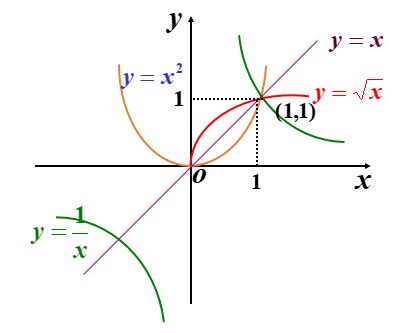
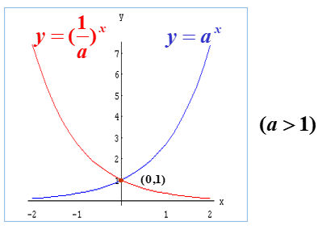
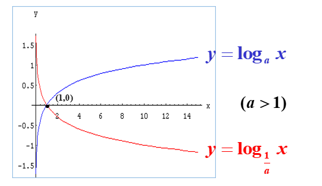
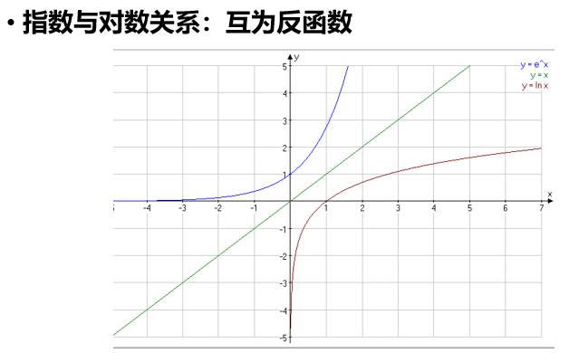
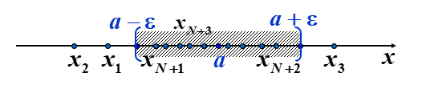

# 第一章 函数
定义：设x和y是两个变量，D是一个给定的非空数集，若对于x ∈ D，变量y按照确定的法则f总有确定的数值和它对应，则称y是x的函数。

记作  `!$ y=f(x) $`

y叫做因变量，x叫做自变量 。

当  `!$ x_0 \in D $`时，称`!$ f(x_0) $`为函数在点`!$ x_0 $`处的函数值。
函数值全体组成的数集`!$ Z = \{ y|y = f(x),x\in D \} $`成为函数的值域。

**函数的两要素：定义域 与 对应法则**

## 函数的性质

1. 函数的有界性
2. 函数的单调性
3. 函数的奇偶性
4. 函数的周期性
  
## 反函数

`!$ y=f(x) 与 y=f^-1(x) 的关系是x、y互换，他们的图形关于y=x对称 $`
`!$ y=f(x) 单调单值，则y=f^-1(x)单调单值 $`

> 注意：反函数的写法和逆的写法是一样的。

## 复合函数

## 初等函数

以下六类函数称为基本初等函数：
1. 常量函数 `!$ y=c(c为常数) $`
2. 幂函数 `!$ y=x^\mu(\mu为实数) $`

> **性质：** 
 >  `!$ 1.当\ \mu>0时，幂函数(x>0)过(1,1)点，是增函数 $` 
 >  `!$ 2. 当 \mu<0时，幂函数(x>0)过(1,1)点，是减函数，以x轴、y轴为渐近线。 $`

3. 指数函数 `!$ y=a^x(a>0,a<>1) $`

> 指数函数的运算
> `!$ a^{m+n}=a^m·a^n $`
> `!$ a^{mn}=(a^m)^n $`
> `!$ a^\frac1n=\sqrt[n]a $`
> `!$ a^{m-n}=\frac{a^m}{a^n} $`

4. 对数函数 `!$ y=log_{a}x(a>0,a<>1) $`

> 对数函数的运算
> `!$ log_abc=log_ab+log_ac $`
> `!$ log_a \frac bc = log_ab-log_ac $`
> `!$ log_ab^c=clog_ab $`
> 对数的换底公式：`!$ log_ab=\frac{log_cb}{log_ca} $`

5. 三角函数`!$ y=sinx,y=cos x,y=tanx,y=cotx $`
6. 反三角函数`!$ y=arcsinx,y=arccos x,y=arctanx,y=arccotx $`

**定义：** 凡是由常数和基本初等函数经过有限次四则运算及有限次的函数复合所构成并可用**一个式子表示**的函数，称为初等函数。

狄利克雷函数与黎曼函数是非初等函数

$$D(x)=
\begin{cases}
1,x\in Q\\
0,x\notin Q\\
\end{cases}
$$

# 第二章 极限

- 极限的思想是近代数学的一种重要思想，数学分析就是以极限概念为基础、极限理论(包括级数)为主要工具来研究函数的一门学科。
- 极限是构筑微积分坚实理论体系的基石。要想对数学分析这门学科的实质有一个真正的了解和掌握，就必须准确掌握极限的概念和无穷小的分析方法。 

## 数列极限

### 收敛数列的定义
> 一般地说，对于数列`!$ \{a_n\} $`，若当`!$ n $`充分变大时，`!$ a_n $`能无限接近某个常数`!$ a $`，则称`!$ \{a_n\} $`收敛于`!$ a $`。下面给出严格的`!$ \epsilon-N $`数学定义。
> **定义1** $$ 设\{a_n\}为一个数列，a为一个常数，若对于任意正整数\epsilon>0，总存在正整数N，当n>N时，|a_n-a|<\epsilon，则称\{a_n\}收敛于a，又称a为数列\{a_n\}的极限，记作\lim_{n\to \infty}a_n=a (或a_n\to a，n\to \infty) 若\{a_n\}不收敛，则称\{a_n\}为发散数列。  $$
> **例子：**
> 用`!$ \epsilon-N $`定义验证极限
> `!$ 例1\ 用定义验证：\lim_{n\to \infty} \frac1n=0 $`
> `!$ 分析 对于任意正数\epsilon,要使|\frac1n-0|<\epsilon，只要n>\frac1n $`
> `!$ 证：对于任意正数\epsilon，取N=[ \frac1\epsilon ]，当n>N时，$` 
> `!$  |\frac1n-0|<\epsilon，所以 \lim_{n\to \infty}\frac1n=0 $`

> 数列极限的几何解释：
> `!$ 由定义 |x_n-a|<\epsilon $`，得`!$ a-\epsilon<x_n<a+\epsilon $`
> 
> 对任意给定的`!$ \epsilon $`邻域`!$ O(a,\epsilon)=(a-\epsilon,a+\epsilon) $`，总存在`!$ x_N $`，第N项以后的所有项`!$ x_{N+1},x_{N+2},··· $`全部位于这个邻域内，只有有限多个（至多只有N个）落在其外。
> **例子：**
>定理：若数列`!$ \{a_n\} $`收敛，则他只有一个极限
>证明：
>`!$设 a 是 \{a_n\}的一个极限 $`
>`!$   下证\forall b <>a,b不是\{a_n\}的极限  $`
>`!$  取\epsilon_0=\frac 12|b-a|，取ab之间的中间点  $`
>`!$  在U(a;\epsilon_0)之外至多有\{a_n\}中的有限项   $`
> `!$ 所以在U(b;\epsilon_0)内至多有\{a_n\}中的有限项目 $`
> `!$ 所以b不是\{a_n\}的极限 $`
> `!$ 即证明收敛数列只有一个极限 $`
  
### 迫敛性（夹逼准则）

> **定理2.6：**
> $$ 设数列\{a_n\},\{b_n\}都以a为极限，数列\{c_n\}满足：存在N_0，当n>N_0时，有a_n<=c_n<=b_n，则\{c_n\}收敛，且\lim_{n\to \infty}c_n=a $$

### 四则运算法则

>**定理2.7：**
>$$ 若\{a_n\}与\{b_n\}为收敛数列，则\{a_n+b_n\},\{a_n-b_n\},\{a_n·b_n\}也都是收敛数列，且有 $$
>$$  (1)\lim_{n\to \infty}(a_n\pm b_n)=\lim_{n\to \infty}(a_n) \pm \lim_{n\to \infty}( b_n) $$
>$$  (2)\lim_{n\to \infty}(a_n· b_n)=\lim_{n\to \infty}(a_n) · \lim_{n\to \infty}( b_n)，当b_n为常数c时，\lim_{n\to \infty}c b_n=c\lim_{n\to \infty}b_n  $$
>$$  (3)若b_n\neq0，\lim_{n\to \infty}b_n \neq 0 ，则\{ \frac{a_n}{b_n}\}也收敛，且\lim_{n\to \infty}\frac {a_n}{b_n}=\lim_{n\to \infty}a_n/\lim_{n\to \infty}b_n  $$

### 数列极限存在的条件

## 函数极限

# 第三章 微分
## 函数的连续性
## 导数和微分
## 偏导数

# 第四章 微分的应用
## 洛必达法则
## 导数与极值的应用
## 泰勒公式

# 第五章 定积分

# 第六章 级数