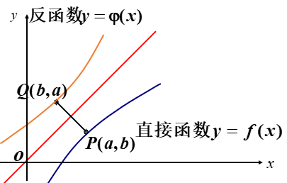
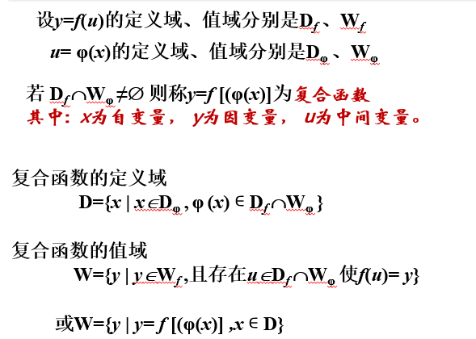
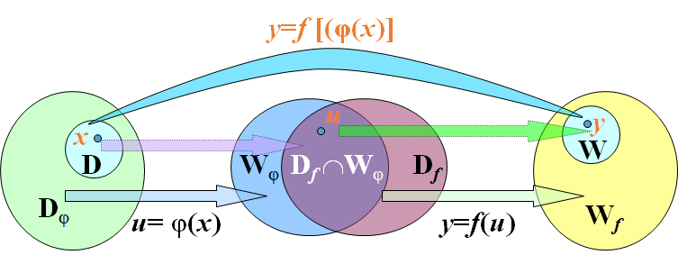

# 第一章 函数
定义：设x和y是两个变量，D是一个给定的非空数集，若对于x ∈ D，变量y按照确定的法则f总有确定的数值和它对应，则称y是x的函数。

记作  `!$ y=f(x) $`

y叫做因变量，x叫做自变量 。

当  `!$ x_0 \in D $`时，称`!$ f(x_0) $`为函数在点`!$ x_0 $`处的函数值。
函数值全体组成的数集`!$ Z = \{ y|y = f(x),x\in D \} $`成为函数的值域。

**函数的两要素：定义域 与 对应法则**

## 函数的性质

1. 函数的有界性
2. 函数的单调性
3. 函数的奇偶性
4. 函数的周期性
  
## 反函数

`!$ y=f(x) 与 y=f^-1(x) 的关系是x、y互换，他们的图形关于y=x对称 $`
`!$ y=f(x) 单调单值，则y=f^-1(x)单调单值 $`

> 注意：反函数的写法和逆的写法是一样的。

## 复合函数

## 初等函数

以下六类函数称为基本初等函数：
1. 常量函数 `!$ y=c(c为常数) $`
2. 幂函数 `!$ y=x^\alpha(\alpha为实数) $`
3. 指数函数 `!$ y=a^x(a>0,a<>1) $`
4. 对数函数 `!$ y=log_{a}x(a>0,a<>1) $`
5. 三角函数`!$ y=sinx,y=cos x,y=tanx,y=cotx $`
6. 反三角函数`!$ y=arcsinx,y=arccos x,y=arctanx,y=arccotx $`

# 第二章 极限
## 数列极限
## 函数极限

# 第三章 微分
## 函数的连续性
## 导数和微分
## 偏导数

# 第四章 微分的应用
## 洛必达法则
## 导数与极值的应用
## 泰勒公式

# 第五章 定积分

# 第六章 级数