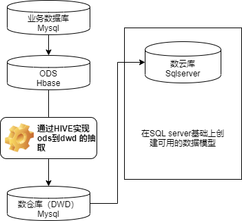

[toc!]

# 2019-10-9数据中心会议
## 现有工作回顾


### 精准营销

a. 目录划分，现阶段按照功能划分，未来可能按照角色比较好。
b. 还涉及部分门店的。

### 成本分析

刚开始做的时候忽略了实际的部分。
遇到的最大的困难，规则不明确。

eg1. 财务正常结算需要做的动作。每月归集。
材料成本归集：将下面的过程使用数据库完成。
工人成本归集：
管家成本归集：

之前的做法：建立合同台账，里面有合同号，其中就有**材料成本**需要取出入库报表每个合同号查询。

eg2. 财务每月结账（把每个竣工的合同，确定收入和各个部分成本）。
结账需要 收入（合同收入、变更、抵价款等）、材料成本（由于某些实际原因，项目竣工之后还产生项目发货等）、工人成本、管家成本准确。

结账后（售后）

问题1 ： 没有一个确定的标志性的结账的时间（现在用的是导入的记账月，未来她们会创建一个‘管家账单确认月’），需要完全与财务保持一致。

问题2： 税率，税率调整和合并合同调整的问题。现在ERP系统中没有历史税率信息。未来可能也使用手工台账导入。

## 未来工作计划

要与数仓1.0密切合作。
完整看下来现有报表，我们思考一个问题，**缺什么** 或者说未来怎么做。

### 营销体系（从现在到十一月中旬）

-  首先数据要做准。
1. 前段时间对数据差异做了一个系统的梳理。
2. 但是对于整个报表体系还没有系统的梳理。
3. 所有报表进行一轮检查，有问题的清理，同时整理目录结构。
4. 缺少门店的报表。
5. 报表优化，现有报表在现有条件下做到最好。

### 后续
采购、物流、售后、工程、交付管理、财务。

### 现有整体架构

五层：报表设计（展现层）
四层：数云体系  业务建模（建立查询、公共维度、公式、块属性等）
三层：数云体系  数据模型（事实表维度表、语义层）
二层：数云体系  数仓 通过 ETL生成 （Sqlserver）
一层： 实时备份库  （Mysql /Sqlserver数据库)
底层： ERP   EAS    HRS     OA   等


# 2019年10月10日  数云与BI差异说明及处理

1、每个字段的取值位置与BI是否相同。
2、大的取值逻辑，模型的取值逻辑。
3、订单明细的首次渠道的定义，是否需要追溯到最早，还是需要订一个时间段。现阶段是全库去重。

备忘：to 小雪。由于取数逻辑导致的维度的差异，如果可以在报表层面展示出来的话就全部给展示出来。

一、精准营销模块
  现阶段用户穿刺表的维度现在都是取得首次订单维度。需要确定维度聚合时怎样取到最有效的信息。
eg.假设现在有同一个用户同时装两套房子，那么我们怎么来取数？
  

Q1：确定好主体，一个人一套房的一次装修。将该主体的一系列订单汇集在一起，如何取主体的聚合维度？
 A1_1: 明细订单放上主体的首次订单的维度信息。
 A1_2：同一个user_id可以去重，但是同一个user_id如何/什么时候区分业务主体。


Q2：如何准确的确定每个用户的各个阶段的首次。
  A2_1:周芳： 首次预约时间、首次有效时间（该用户所有有效时间的最早有效时间）、首次到店时间（该用户所有到店时间的最早到店时间）。、


Q3: 不同的取数方式的规则，以及可能产生的差异？

Q4: 首次预约的信息和用户最有效信息的区别。

Q5: 建立重复订单的表，来推动业务标记的优化。

Q6: 回款表已经改成了fms里的回款表，提前做好切换数据源的准备。

Q7: 用户穿刺表&订单明细表的四个金额与周芳核对。

Q8: to 大宝：订单核实状态我是怎么取的？二级状态我是怎么取的？

Q9: 哪些数据会随着时间呈现出不稳定状态。其中又有哪些是需要固定数据来进行考核的。


## 问题记录

1. 订单状态时间与实际业务逻辑不符，比如还未交订就排了设计师。
2. 客户交订换号之后，到店时间比交订时间晚，时间错位。
3. **需修改用户穿刺表的订单最有效信息（维度）。**
4. 主要 数仓与数云更新时间、数据一致。
5. 如果要关闭老BI，有部分数据需要实时查看。区分实时的报表和分析型的报表。
6. 同一个用户的多条订单，有效信息分散在各个订单上。
7. **在做数据处理时需要明确规则，并且记录且公布出来。**
8. **跟进一个用户有多个手机号的问题 with 周芳姐**
9. 当订单状态为10的时候金额不取 with 周芳姐。
10. **历史数据存储，部分报表历史存储 with 数云。**
11. 分类整理，crm需要处理的，数据中心需要处理的问题。
12. 一天两次更新的问题，会导致与其他系统之间出现问题。
13. 梳理需要实时进行更新的报表。

### 一个半月的时间对现有问题进行规划。
 我处需要进行处理的内容有：
 
-  all day 数云现有取数逻辑整理成文档。**后续在做数据处理时需要明确规则，并且记录且公布出来。**
-   3 day **需修改用户穿刺表的订单最有效信息（维度）。**
-   3 day 同一个客户有可能会修改手机号，这部分怎么处理，与周芳姐沟通。
-   固定指标类的数据，**需要对历史数据存储，部分报表历史存储 with 数云。**
-   数仓数云保持数据一致（包括明细数据、更新时间等）
-   取用  退订时间  的规则未确认 with 周芳姐，浩哥。

## 底层架构套路

### 数云数仓底层逻辑核对

数仓的实时计算需要耗费内存，不能有太多的实时任务。
**查看现有数仓的数据结果。**


# 2019年10月11日 财务知识简介

## 数云eas数据结构
一笔凭证包括
- 机构（主体） 某某公司
- 记账日期和业务日期有可能不同，但是尽量是月份相同。强调会计期间。
- 凭证号  （顺着来的）
- 会计分录
- - 摘要，基本说明。eg.支付8月材料款。
- - 科目，分类方法（看资产负债表） eg. 220201 应付账款_应付账款-供应商  100201 银行存款_人民币。
- - 借方，资产类科目  增加 （了解一借多贷）
- - 贷方，负债类科目  增加
``` 
借贷方向说明
资产类科目：借方增加 贷方减少
负债类科目：借方减少 贷方增加
成本类科目：借方增加 贷方减少
损益类科目：收入 借方减少 贷方增加
                      成本和费用 借方增加 贷方减少
```
- 三大报表  
- - 资产负债表 企业的资产权益的情况。 一般左边是资产，右上是负债，右下是所有者权益。
- - 损益表（利润表）。成本费用的区别。
- - 现金流量表 。企业现金情况的说明。
- 报表项目是部分科目的合并。

| | a | b |
| --- | --- | --- |
| 金额 | 10 | 20 | |

|     |     |
| --- | --- |
|     |     |


# 2019年10月15日 数据中心梳理
## 系统过多
到现在为止，一共有BI、数仓、数云三个系统，使用的话需要三方面数据统一，不利于使用使用以及维护。

数仓是比较好的用大数据的方式完成的，数云是比较好的完成了分析模型的建立，现在来思考如何整合大数据和分析模型（包括计算和展现）。

## 整合系统
###  技术方案第一阶段
- 主要工作内容
- -  抽取spark的结果表（mysql）到现有的sqlserver中。依托现有的产品来整合，将ETL处理下沉到黄磊部分。这样的数仓和数云的基础数据相同，省去很多核对工作。
- - 现有BI不可代替的地方有两方面，一个是模块全面，一个是实时性的要求，还有移动性的要求。
- - 现在还缺少哪些模块（和BI相比），争取迁移到数仓或者数云中。
- - 元数据的管理dataphin（类似的开源软件）。


| 模块 |   内容	 |  工作分配   |
| --- | --- | --- |
| 交付管理 | 现有bi和数云报表梳理    |     |
 | 交付管理 | 现有bi和数云底层模型梳理    |     |
 - 主要工作内容
 - - **一起梳理交付管理的模型，给黄磊去做。我来牵头以交付管理文档中心，周芳补充。（十月份）**
 - - CRM（精准营销 callcenter 门店 火炬 新零售）部分。周芳牵头，两方模型核对。之后做报表级别的核对，看缺少哪些字段。
 - - 我的工作，与黄磊沟通，了解现有精准营销他们是怎么做的，看看有没有办法跟数云的模型结合。
 - - 剩下的模块（采购 物流 售后 交付 财务 基本信息 设计师系统），整理剩余模块BI和数云两边的字段，看有哪些需要快速上来使用。提供出来，由我和老邓商量建立模型在数云中展示。
 - - **注意学习的spark的抽取，分担黄磊的工作量。**
 
###  技术方案第二阶段
- 主要方向
- - 大数据版的分析云上线，需要进行测试、迁移等工作。明年三月份提供评估结论。
- - spark工作方式以及计算方式，在后期的瓶颈在什么地方。

## 其他事项

- 要注意元数据管理。 （目的：明确规则，减少歧义） 
- 与需求段的接口，与技术的接口，内部的接口。
- to 小雪：数云的移动端要开始尝试使用了。主要是整体性的报表（可咨询周芳姐）。
- 精准营销的费用数据的接口。
- 数据中台的规划（明年的主要工作）。


# 2019年10月15日CRM营销梳理
## 获客
指标：ROI 投入产出  转化效率  等
1. 线上 通过pv uv等深入分析。分渠道的分析逻辑不同。
2. 线下 

## 门店管理
指标：预算实际比、响应效率、工作效益、回款、等
1. 获客管理
2. 绩效管理（人、小组、门店）

## 新零售
1. 火炬
2. 一站式（索菲亚）


2019年10月18日

老客户数据
1. 邀请客户数：只要有客户经理就记作一个邀请客户。
- 老客户邀请客户数：老客户列表的话  邀请客户数：应该是新客户表o_pid对应老客户表id，则+1 OK
- 客户经理邀请客户数：客户经理列表的话  邀请客户数：应该是老客户表m_pid对应客户经理表id，则+1   OK

2. 实际报名数（该老客户下有多少新客户报名数）：是老客户的下线，且有手机号 OK
3. 交订人数（看的是新客户的交订人数）：新客户用户编码在 user_info表中platform in (17,77) 的。该用户的所有订单中有交订的。 OK
4. 签约人数（看的是新客户的签约人数）：新客户用户编码在 user_info表中platform in (17,77) 的。该用户的所有订单中有签约的。 OK
5. 交订客户加入数（原来的订单客户加入数。老客户的信息，老客户交订数）：首先看老客户是否交订（用手机号找user_id，然后关联订单数据）。 OK
6. 新客户扫码数：新客户表有数据就算。 OK
7. 交订时间、签约时间：新客户用户编码在 user_info表中platform in (17,77) 的新客户订单交订时间和签约时间取首次时间。 OK


# 2019年10月21日 dataphin元数据管理相关

## 数仓构建整体流程

- 数据调研
- - 业务调研  要看这个业务的本质是什么，为后续准备。
- - 需求分析
- 数据域的划分（商品域、交易域、会员域 用来存放不同意义的指标*）
- 构架总线矩阵
- 构建明细模型
- - 构建dim维度模型。
- - 构建DWD事实模型。
- 构建汇总模型
- 明确统计指标
- - 明确原子指标和派生指标。
- 数仓优化
- 数据验证＆应用


# 2019年10月29日 数据中心会议

## 数据中心多系统人员融合

### 迁移与融合

1. 现阶段迁移已经迁移用户表一般，剩余工作量大概3个用户表。
2. 实时性要求：回款、任务指标（交定签约）。从黄磊这边走的话卡夫卡还是内存计算（是否需要内存日志？需要技术如何配合？）？确定一个实时查询的方案（日志查询实现较为复杂）。或者现在在老BI上继续维护？  -- 2019年10月29日 dh 暂定由周芳姐来维护，优化sql效率。
3. 

## 数据中心工作进度

1. 精准营销按照城市做表分区。
2. 多用户之后并发量的问题。
3. 调整到交付管理上。
4. 索菲亚等新零售的一站式现有模型无法体现。
5. 命名规则以及取值规则规范。
6. 现有模型的字段导出和报表中使用的字段。to 姚健
7. 其它系统账号密码能否直接取用？以及其他优化切换系统体验的操作。

- 营销端工作
- - 一站式和火炬计划整体逻辑与现有模型调整。
- - 报表的结构组织呈现。
- - 优化，多查询，大数据量等的优化。


# 2019年11月11日 风控数据部门会议

## 怎么做企业文化
1. 建立规则-你的价值观
2. 共同规则
3. 建立情感链接

## 部门日常工作管理


- 工作进度表注意维护。每一条落在实处。
- 每周例会分享与目标之间的差距？设定目标的方式SMART方法。
- 部门整体目标，分解到个人身上。

## 比对目标，以及缩短的方法

个人目标：分析方法的学习，通过这个方法找到数据的内容。（部门短板）
加强信心，定一个明亮的灯塔。

大数据、架构、呈现（UI）、标准建立。

# 2019年11月19日 风控数据部门会议

## 工作回顾

基础信息的维护，要维护好基础信息表。从五个角度去描述各个字段。
1. 业务限定
2. 统计周期
3. 统计粒度（维度）
4. 原子指标
5. 派生指标


# 2019年12月2日 风控数据部门例会

## 2020工作展望

### 要注意推广应用。
- 资料文档说明书
- 


使用说明。
好的方面在于三个数据系统开始融合。
部门的bp:通过数据能力提高我们的效率效益，我们的数据应该是有一个完整的整合能力的。而且还应该有外部数据。
外部数据的整合和融合。

### 技术提升

现有架构迁移到大数据平台。
但是呈现时候依然还是使用的传统数据库，依然存在效率瓶颈，包括后续的分析没办法在报表工具内实现，分析工具现在没有。

### 实时数据

实时数据的展示，如何能带给他们完整一致的体验。比如同一门户，同一权限控制。

### 移动端

移动端的呈现。

### 权限控制

### 优化

## 2020工作规划

### 系统迁移到大数据平台上

待定，主要是尝试。
现有架构通过优化应该能满足需求。

### 报表应用推广

1. 营销管理
2. 成本毛利
3. 交付管理
4. 财务管理

### 继续增加模型

1. 现有模块扫尾。
2. 售后管理。
3. 采购物流扫尾。

### 实施的规范性

1.需求的规范。-- 将需求转化为数据。
2.测试的规范性。


### 公司急于解决的问题

1. 低成本获客。-- 通过更高级的分析方法来解决。
2. 工程质量管理
3. 成本控制
4. 工料配合（销售预测-采购结构-签约进度-开工时间-施工进度）
5. 效率（人效）

## 2020时间计划

### 一季度

- 营销完善
- 推广应用
- 完成交付管理
- 启动采购物流
- 启动售后

### 二季度
- 完成采购物流
- 完成售后
- 衔接交付
- 启动移动端

### 三季度
- 上述模块收口。
- 有可能启动大数据的调研。

### 四季度
- 日常维护
- 回顾和规划

2019年12月4日 shg 管理调整表上传逻辑：
1、我们把每个机构每个会计月的管理调整表（上传的源表）记作 e，分别为e1,e2···en ；所有上传表上传之后都存储在表A中，A中所有数据为实际上传的表的内容。eg. 上传了e1  e2  e3 则 A=e1+e2+e3，之后上传界面中删除e2，则A=e1+e3 。
2、因为需要存储历史数据，所有我们把每次新增的数据都存在表B中。那么何为新增数据？我以每个机构每个会计月的上传时间为准，因为e只能是固定机构固定会计月的数据，所以认为机构-会计月-上传时间可以唯一确定上传文件e。eg. 上传了e1 e2 ，此时这两张上传表都是新增，则B=e1+e2 。后来发现e1中数据错误，因此删除e1，上传了e1.1 。此时B插入新增数据，即 B=e1+e2+e1.1 。
3、通过财务管理调整上传参数控制表Config来控制我们想要的数据。Config中存储有 机构、会计月、上传截止时间；让B与Config关联，得到B中上传时间小于上传截止时间的 机构和会计月 的最后上传时间的e，最后将这部分数据放入最终结果表 C 中。eg.B=e1+e2+e1.1  其中 e1 e1.1为同一机构同一会计月的不同版本。e的上传时间分别为  2  3  4 月，上传截止时间为3.5 。则 最终的结果 C = e1+e2 ；如果上传截止时间为5 则最终的结果C=e1.1+e2 。
4、为了让Config上传之后报表立即生效，将步骤3在Config表上传后也跑一次。


# 2019年12月9日 风控数据部门例会

## 回顾

花费了一年时间搭建出了一个框架，但是没有完成的项目。
中间有提升，如何把提升固定下来。
数仓ods-dwd-dws 三层次的了解。
新提出了指标集的概念。
了解需求的标准方式（业务限定、统计周期、统计粒度、原子指标、派生指标）

## 数据测试

如何保证我们的数据出来的是正确的？需要通过测试，那么如何进行测试？
开发人员测试：要有测试结果，测试了哪些东西，出具测试报告。
报表开发人员测试：单表测试，
综合报表测试：成品报表测试。
分公司公测：给到分公司测试。


## 个人问题

- 架构分层混乱。（需要有一个理论支撑）
- 明细逻辑，现在分好多部分，相互引用没有好的管理。（需要review）
- 数据分析技术，与自己的需求分析结合。
- 工作的意义，部门的意义。怎么能从数据中真正的发现价值。
- 成果提交，验收。


- 考虑黄磊部分的架构。
- 以后的工具可能还会修改，暂时不要大动。

# 2019年12月16日 会议纪要

## 反思上周工作

不可聚合指标有多种。
分类维度和聚合维度


## 目标

- 系统日常维护。
- 完成营销系统的整合。一周内尝试。
- 客户经理、设计师、售前客服人员维度表的规范。
- 落实DWD。
- 产品部报表。营销报表。
- 产品部、人员、dwd、工程。

老辛报表本周出一半以上。
人员维度处理。

## 明年工作内容和KPI

想一下自己的工作的KPI，可量化。
五个指标内。

# 2019年12月30日  会议纪要

## 2019不足

项目从零开始，确定大方向的前提下，不断调整，不断的发现问题解决问题。
做事不轻易放弃，寻找解决方案。

独立完成整个抽取逻辑。
几个excel抽取，流程规范，巧妙的处理逻辑，在有限的系统功能下实现相对自动化的需求。

不足  
专业度上还不够
抽取逻辑不够规范，没有提前总体的规范（中间问题不断修改）

ods - dwd - dws
## 未来定位

高级分析的相关性的工具。
数据的架构体系（数据结构，硬件结构），系统优化。
在数据架构上，搞清楚哪些问题要在哪些阶段来解决。

## 2020年

**如何能够快速成长？**

- 知道自己要什么？选对方向，做正确的事情。
- 在知识地图中找到自己的位置。
- 认准方向，开始学习，向书本（前人）学习，向成功者学习，自己的思考。
- 总结、提炼、归纳。把遇到的问题总结出来，成为自己的知识。


# 2020年1月6日 会议记录

火炬计划和配套产品加到营销中去。

今年迈出一步，从简单的描述性统计扩展到数据挖掘。如何应用。从渠道花费开始入手。

完善各地的基准理论毛利。

实时实现的问题。要有完整的需求才能确定实现方案。

# 2020年1月13日 会议记录

## 大宝

- 上周工作
- - 用户穿刺表指标的增加（dwd）。
- - 启动了指标集的开发。
- - 系统日常维护。
- 本周工作
- - 指标集的开发。
- - 营销渠道api的开发。
- - 老邓周六问题的解决。

## 周芳

- 上周工作
- - crm增加了配套目标，BI增加了配套回款相关的报表。
- - 采购物流的派生指标。
- - 工程交付增加了部分字段。
- - BI表设计日常维护。
- 本周工作
- - 整理售后和投诉的相关需求文档。
- - 营销渠道api的开发。
- - 把工人管家的基本信息、评星等基础表添加到交付管理系统里。


## 小雪

- 上周工作
- - 测试指标维度（时间周期等）。
- - 开启了交付管理的报表制作。
- - 开启营销部分的设计师管理的报表制作。
- - 数云日常维护。
- 本周工作
- - 做完设计师管理的报表制作。


## 黄磊

- 上周工作
- - 月历表设计师修改。
- - 订单表字段修改。
- - 采购物流加到调度中。
- - 营销渠道api的开发。（现在能调通，返回记录显示成功，但是没有返回数据；与百度联系，已经提交工单，但是百度暂未回复；也已寻求技术支持，并无较好的办法，只能等待与百度的沟通结果。）
- 本周工作
- - 营销渠道api的开发。
- - 交付管理增加部分字段。

# 2020年2月3日

大家注意安全！
文化创新 共渡时艰。
新冠病毒带来的影响重点处理。

营销的报表 供应商已经在开发块的分段器，dwd 和 dws
交付部分，首先保证老BI放到数云中，保证数云的推广应用。
黄磊交付的完善，实时部分。

##  上周回顾

- 上周工作
- - 用户穿刺表指标的增加（dwd）。
- - 启动了指标集的开发。
- - 系统日常维护。
- 本周工作
- - 指标集的开发。
- - 营销渠道api的开发。
- - 老邓周六问题的解决。

## 本周计划

- 继续指标集的开发。
- 营销渠道api的开发。
- 营销用户表和订单明细表指标已经添加完成，需要测试，如有问题进行修改。
- 系统的日常维护。
- 部分未解决问题的处理，详细内容后续记录如下。


# 2020年3月13日 会议记录
 
 ## 日常沟通
 
 工作上不同的沟通方式。
 强调邮件的沟通方式的做法。
 
周期性结论性的正式的东西使用邮件发送。

忌讳：邮件发不重要的事情，争执责任的事情。

OA也是正式的工作方式，但是这种沟通方式需要使用微信等即时性的工具辅助提高沟通效率。

电话和见面是无法避免的。

避免错误和错别字，写完之后自己读一遍。


# 2020年3月23日 渠道花费新需求

## 渠道花费新需求讨论

问题1 ： 同一个账户底下是否有可能有多个渠道？例如百度丝路的账户是从哪里来的？

问题2： 


## 需求明细

1. 按照代理商维度查看余额、充值、花费。
2. 需要明细账户和代理商的对应关系。
3. 还需要明细渠道去看。

供应商向账户冲钱垫款，重点在于账户充值时间，重点在于回款计划。

初始化之后从消费记录汇总出来与充值记录核对。


**账户冲值表里面只有账户和代理商维度。
花费明细表要求账户、代理商、渠道。
查看余额
**

# 2020年4月24日 会议记录


## 黄磊部分

### API 接口
百度搜索 360搜索  百度原生 搜狗搜索 
今日头条差账户。
神马搜索权限申请已申请，暂未回复。
腾讯 广点通有投放
和知乎当前无投放。

与尚晓龙沟通API接口的事情，还缺少哪些？现在有些没投放，黄磊没有取。

### 实时部分


## 营销部份

邓老周芳进行测试
账户余额 + 充值记录 - 花费 = 当前账户余额

## 周芳需求分析

### TMS 系统
供应链的运输系统底层完成 80-90% 

### 实时数据
整理哪些需要实时指标
1、汇总级实时数据
2、底下人的明细数据的实时？是否需要

邓老：首先满足领导层汇总实时数据。

实时数据导致数据一致性产生问题。
考虑半夜暂停投放。

# 2020年5月13日 账户当前余额会议

所有渠道可能都需要增加虚拟账户。
垫款账户才需要核对当前余额，后付款的账户是走的对公付款。
待加款（返点充值）因为并不是在当前任何账户下的，因此需要在账户供应商对应表里面增加一个虚拟账户，将所有充值记录的款项放到此虚拟账户下。


账户代理商对应表增加是否是垫款账户。

充值记录增加是否垫款收费类型？

账户充值记录表变更为流水形式。

赠款的影响之前记录的话，不变更原本数据，使用新增红冲记录来进行。要增加影响的业务范围。
例如：一月账面：实际=1：1   二月返了50万，需要将这50万平均分到一月份的每一条记录上，减去这部分实际花费。

充值记录增加业务日期
现金  出钱日期
返点  确认日期

花费
花费 花费日期


广点通 使用地域报告做拆分比例，用账户的数据和比例乘。

除差异后差值继续跟踪

赠款在充值记录里面体现。

充值记录发生即上传。

-- 
会议纪要

此次账户当前余额核对发现存在以下差异：

 1. 缺少充值记录
 2. 账户赠款
 3. 花费录入差异（广点通）
 4. 除差异后差额

# 2020年5月20日 部门发展规划

项目需求确定后邮件发出确定，附上样表方便查看。

报表上线后收集使用者反馈和回复，让使用者记录不便的地方记录下来隔一段时间优化迭代报表。

BI迁移，重点在于两边加起来是整体，但是要搞清楚两边分别有什么。只要保证两边统一，对数据负责即可。
BI报表清单、分析云报表清单，两边有机的结合，保证能满足需求即可。

后续正规之后，**多查看做出来的报表是什么样子的**站在报表使用者的角度上了解业务。


 ## 会议纪要
 
1、清点两边报表清单


2、目前项目整理

3、有项目需求抄送主管，尽量能形成一套东西的印象。

4、已上线东西周期优化，形成闭环，提高用户体验。

5、站在用户、业务角度看问题，提高自己的level

# 2020年6月11日 部门例会

## 每个人的最近工作

我现在主要是五分之二的开发五分之一点五的日常百分之一点五的实时。


# 2020年7月16日 高并发处理方式

二、如何提升系统的并发能力

互联网分布式架构设计，提高系统并发能力的方式，方法论上主要有两种：垂直扩展（Scale Up）与水平扩展（Scale Out）。
垂直扩展：提升单机处理能力。垂直扩展的方式又有两种：
（1）增强单机硬件性能，例如：增加CPU核数如32核，升级更好的网卡如万兆，升级更好的硬盘如SSD，扩充硬盘容量如2T，扩充系统内存如128G；
（2）提升单机架构性能，例如：使用Cache来减少IO次数，使用异步来增加单服务吞吐量，使用无锁数据结构来减少响应时间；

在互联网业务发展非常迅猛的早期，如果预算不是问题，强烈建议使用“增强单机硬件性能”的方式提升系统并发能力，因为这个阶段，公司的战略往往是发展业务抢时间，而“增强单机硬件性能”往往是最快的方法。
不管是提升单机硬件性能，还是提升单机架构性能，都有一个致命的不足：单机性能总是有极限的。所以互联网分布式架构设计高并发终极解决方案还是水平扩展。

水平扩展：只要增加服务器数量，就能线性扩充系统性能。水平扩展对系统架构设计是有要求的，如何在架构各层进行可水平扩展的设计，以及互联网公司架构各层常见的水平扩展实践，是本文重点讨论的内容。

## 使用nginx的方式来处理并发
因为之前服务崩溃过，姚健建议使用nginx做一个负载均衡。

Q1. 什么样的情况下需要使用nginx来做负载均衡？老BI没有使用负载均衡，每天几千次访问。
nginx两个作用，一是做负载均衡，反向代理，统一访问入口网关，对内把web的8008端口服务复制成多个端口，对应到服务器上的五个进程，nginx配置到五个端口上，提供的服务都是同样的web服务，这样如果某个进程挂掉了其他的还可以用，**避免了服务挂掉**同时便于资源的利用。二是当有两台服务器的时候，可以配两台服务器，**避免了服务挂掉，另外升级的时候可以仅升级其中一台服务器，可以进行测试；还可以分配领导到空闲服务器上。**
nginx的第二个功能，可以做一个传输协议的压缩，开启gzip压缩，**会大大提升网络的传输效率。** 可以缓解网络带宽的问题。

户的建议：还不清楚量级，可以先做两台，如果后期压力比较大的话再加。但是需要一个方案，因为现在服务是再winserver上跑的。
姚健：现在还不需要两个服务器，先配成多进程即可。
户：建议再买一台服务器，因为当前服务器的内存太低，直接买一台ecs服务器比较好。如果效果不好的话还可以升级服务器的内存。

许：服务如何启动两个进程，配置文件怎么配？

姚健：
复制 BIN 目录，重命名为 BIN1  
进入  BIN1 目录下，找到 BA.Tools.ModifyPort.exe   双击此程序，将端口号修改为  8018和8019


此时会启动   BA.ETLPlatform.Host.exe   和  BA.ReportService.Host.exe *仅启动报表服务即可，不要启动抽取服务*
这就是新的线程的服务。
需要注意的是，8008的两个服务也需要启动，
是在BIN目录下的   BA.ETLPlatform.Host.exe   和  BA.ReportService.Host.exe 


**按照以上配置后出现了以下问题**
1. 由于启动了两个抽取服务，导致第二天抽取出错，以后需要注意，仅启动一个抽取服务即可。
2. 启动两个报表服务之后，使用rpt.ikongjian.com登录不能下载报表，而使用ip+端口号登录服务却可以正常下载。经过许荟配置nginx用ip_hash分发策略之后，问题解决。
3. BA.Tools.ModifyPort.exe 只需要配置基础服务的端口号即可，抽取的端口号保持8009不变即可。否则会影响报表页面的excel上传页面。
4. 2020年8月19日 出现了更新了产品但是部分机器不生效，是因为数云仅更新了BIN目录下的文件，而复制出来的BIN1目录下的文件没有更新。更新产品需要后需要把bin目录下的dll文件复制到bin1下，重启bin1的服务即可。或者将配置文件复制出来，然后重新复制BIN目录。
5. 非公司内网登录 rpt.ikongjian.com 上传接口无效。
> 田呈章@方人也 好了。你更新下。然后找到 “BA.WebApp\excelsubmit”这个目录下的config.json 文件，
> 把
> "useAgent":false, 
> 改成
> "useAgent":true,
> 然后再设置nginx配置文件中增加下面的配置
>  server{
>   listen 80;
>   
>   location /api/ExcelExtractEngine/ {
>         proxy_pass http://127.0.0.1:8009;
>   proxy_connect_timeout   1200; 
>       proxy_send_timeout      1200; 
>       proxy_read_timeout      1200;    
>         } 
>  }

  6. 进bin1   打开 BA.PaaS.Console.exe ，使用 localhost:8018 登录也进行更新。
    

# 2020年7月21日  半年总结

## 主要工作

1. 规范了模型开发的流程。由周芳姐发起，以《BI表设计》和《营销指标集》作为标准文档进行开发，统一规则。
2.  完成了营销、客户经理、设计师、售前客服、木作设计师等指标集。20%
3. 完成了营销费用的入库方案设计并将方案实施落地；目前已将所有20年存在花费的渠道花费数据导入到了数云库中。后续随着业务发展和调整，花费账户也会随之增加，只要是现有方案条件下的账户增加都可以正常拓展增加。20%
  
4. 实时方案的讨论和验证。5%
5. 系统的日常维护、协助测试、模型优化。随着各模块的开发使用，目前数云的结构已经比较复杂，维护优化的工作量也在逐渐增加。25%
6. 协助尽调验证数据。5%
7. 除上述指标集外，根据BI表设计中的要求新增大约十张左右的事实表（工程交付、采购物流、配套、火炬计划、报表等）。20%
8. 优化了营销的部分抽取逻辑。5%
  

## 不足

- **系统测试流程不完善，由于直接在生产环境更新产生过两次数据错误的重大问题了。**
- - 完善测试环境，以后所有新功能上线一定要先在测试环境经过至少一次完整抽取测试和报表测试后才能上线生产环境。
- - 主要的事实表的数据结构检验；有的时候数据抽取虽然成功了，但是由于抽取关联的表存在结构变化导致结果表产生重复数据的可能性，所以需要自行设计检验方案。
- **数据仓库的数据质量还是不够**
- - 部分ETL逻辑上应该关联出来的数据，由于源库历史数据的原因没有关联出来，这部分数据如何处理未解决。
- - 部分指标内有null值，影响计算。
- **模型优化还有空间**
- - 部分大表，例如通话记录表冷热区。
- - 按照时间或者城市分区。


## 提高

 - ods，dwd，dws分层，模型结构更加清晰。
 - 可以独立使用hive sql 进行开发。使用hive开发完成tms的相关dwd和dws抽取。

- 重要资料备份。
- 与周芳姐之间的配合越来越好，效率越来越高。

## 反思

 - 随着部门人员之间的分工越来越明确，我更多的精力放在了纯底层的模型构建上，一方面这确实提高了底层开发的效率，另一方面我也离前端越来越远；这对于我更加深入理解模型、优化模型是不利的。
 - 系统运维如何规范？每天检查抽取的过程，检查抽取的结果（数据结构）。
 - 继续规范数仓数据，只有基础数据规范了，大家都认可了，才有基础去做更加深入的分析。
 - 不要被当前用到的工具和旧的需求限制思路，让手里的数据发挥更大的价值。
 - 我觉得部门很有价值的工作之一是推动指标统一，数据统一。


# 2020年8月7日 数云新产品交流

1. 管理控制台整合到h5中。
2. 报表设计也不依赖ie了。
3. 决策门户更新为多页签的模式。
4. 目录树不能固定到左侧。-- 尽量简洁，重点突出。
5. 新版基于H5设计。设计和展示都是。

未来数云将会有数据湖的方式，数据湖放到RDS服务器上，其他多种数据源都抽取到数据湖上，然后通过ETL过程抽取到模型中。

实时方案确定，
- 一定要将离线和实时的数据分开，保证不影响离线分析数据。
- 实时数据抽取当天数据，结合离线数据创建报表。
- 

# 2020年8月21日 烧烤会分享

爱空间2.0

## 企业文化

### 爱空间相信什么

- 改变命运是从因果发生之后的心态开始。

#### 相信一：因果真实不虚

以客户为中心真的能带来利益么？

> 利他，是经商的起点 -- 活法 稻盛和夫
> 善有善报，恶有恶报，不是不报，时候未到。

因果的故事：六世杀羊，了凡四训，爱空间融资。

因果是宇宙运行的算法

爱空间坚持做善的事情。

 修合无人见 存心有天知
 常抱一心行大道  天地自然不相亏
 
 品牌 建立在客户的长期口碑，而非广告。
 
 #### 相信二  知止而后有定

戒 定 慧

为何需要戒？  Google 不作恶   爱空间 不欺骗

身不由己，那是由了谁？
习性非常可怕

觉性：意识要很清晰。

如何培养觉醒

刻意练习，改变习性，戒发脾气，戒抱怨，戒祸从口出，戒端身正做，戒抽烟，戒病从口入。

学而时习之，不亦说乎。

#### 相信三  相由心生

相是命运外在的呈现
心是心态决定着命运

三个心态
1. 雷霆雨露 俱是天恩   -- 现在的苦难有可能是以后的财富
2. 行有不得反求诸己 -- 反思自己
3. 精进是自己的事情  成就是老天的事情
4. 吸引力法则，心想才能事成。
   

## 如何具体落地 及 重点工作

# 学习与提高

这次分享给我印象比较深的是第三个相信，相由心生。

特别是里面的”行有不得反求诸己“这句话；虽然也知道道理是这样子的，但是以前自己遇到问题之后的处理不是特别好，有些时候潜意识里会把问题跟自己撇清，觉得是各种各样的外部原因导致的问题； 所以我觉得对于我现在来讲从内心深处相信“行有不得反求诸己”这句话并且真的付诸行动才能给自己带来真正的成长。
那么如何做出改变呢？我想可以用培养觉性的方法论，每次遇到问题的时候先不要抱怨，而是反思一下自己，看看自己哪些地方做的还不够好，哪些地方还可以继续提高，把自己的事情做的更好。


# 2020年8月24日 神策数据业务沟通

神策是否能否上传外部数据？明细或者统计数据？
https://manual.sensorsdata.cn/sa/latest/%E6%95%B0%E6%8D%AE%E5%AF%BC%E5%85%A5-1573438.html
数据导入工具

最终目的希望页面位置或者内容能够带来更高的转化，带来的有效比较多。

# 2020年9月4日 部门例会


1.  上线报表修改流程。指标集迭代导致报表更新。
2.   对于上线报表的重视程度。
3.   

售后模块
日常问题处理

- 不同模块数据一致性的问题。
- 模型更新
 
 花费19年补足测试
报表数据核对及问题处理
外网不能上传


当前售后的数据流转结构
与前台脱离较远，最近在看报表。
行有不得反求诸己的实践  如何推动


底层切换，并行时如何处理。
周芳姐重做BI表设计和指标集找个时间一起沟通下。
希望能负责一张报表。
技术部才能最了解底层，我觉得我们部门反而是一个好的处理这个问题的点，深入业务需求，结合后台。


比如深入了解业务，如何做呢？深入参与并理解他们的业务，理解他们重点关注的点；提高思考的一点，如何制定成标准帮助接下来的沟通。

组织创新：组织激励。
一线的要求：认同、超强的执行力
总部的要求：系统思维、

周五上午

# 2020年9月9日 整装大产品调整

确定整装大产品创建新的营销模型。

实时部分沿用之前的处理方式。
要考虑到营销相关维度在其他模型里面也用到了。


# 市场部需求沟通


1. 渠道排序，按照六大渠道进行排序。增加渠道排序。只关注一级渠道的顺序。
2. 业务数据的url上面有账户信息，回头查看一下数据，看看与API的账户信息相关的。
3. 市场部目标如何入数云。


十月二十三  六周年  线上线下分公司


六周年意味着什么  

# 2020年11月12日 会员需求沟通

## 会员标签建设

用户标签是什么？

 - 用户属性/用户行为  描述定义
 - 用户画像，形成具有差异性的形容词。
 - 以应用和业务场景为目标，按照行为特征与规则进行抽象总结沉淀的用户分层。
 - 通过分析用户行为对会员进行分析和预测。


标签分类：标签会有很多，只有分类才会有意义。
猜测=事实+经验推断
通过标签判断事实分类。


先保留事实，不需要猜测。

基础信息

用户行为

业务偏好

事实+判断+规则 = 标签

bettle 要哪些标签，确定标签。
标签流转，技术实现。


### 2020年11月19日 用户标签二次会议

人/房的属性，要求是事实类的信息。（非人为判断，客观存在称为事实类；换言之客户一定可以问出来的。）

#### 销售对呼叫中心需求

1. 装修时间 a.两个月内 b.六个月内  c.一年以上  for：引导话术，促单方式。
-- 2. 装修预算 a.硬装 b.配套  预算较敏感，作为选填项   for：定位能否服务。
3. 是否报价，报价范围。
4. 房屋信息：a.小区名称/大体位置。b.房屋面积  c.新老房  for 如果有小区之前有过的话，更加有点聊天。面积的话判断客户品质，大概会花多少钱。   **房屋信息质量高的话，** 转化率会较高。
5. 家庭结构。
6. 关注点：设计还是省心等。


#### 呼叫中心对市场部要求

1. 预约渠道，需要到三级明细渠道。
2. 预约链接，落地页的链接。一个落地页有多个报名入口。客户点的功能点，确定客户关注点。
3. 预约单备注，  一元设计图/只能微信不能电话。（一元设计图会自动生成预约单）。
4. 预约关键词，搜索渠道，是通过哪个关键词进来的。
5. 预约设备，pc/Android/ios 。
6. 房屋信息，预约界面的房屋信息。


用户标签质量评估。
如何评估？与历史对比，查看某指标前后对比。

下周复盘标签有无问题。


# 2021年2月24日 VMI项目 材料流转


1. 材料变更单存储变更数量，是累加的，不在源表上更新。
2. 发货清单是一张视图，取所有材料变更的合计。
3. 工料需求单 中系统数量、预算符合、管家提报数量不变。工程复合数量会一直变化。
4. 现在通过设计变更单变更的都是工程复核数量。
5. 报价单内只有系统数量。