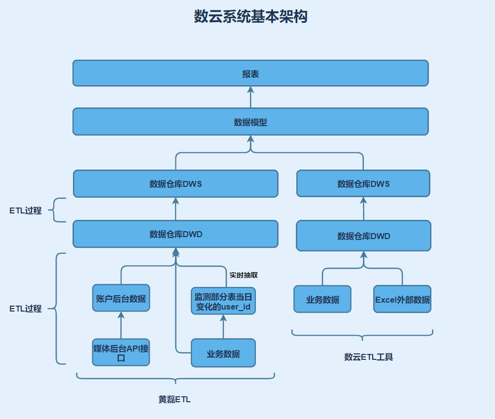
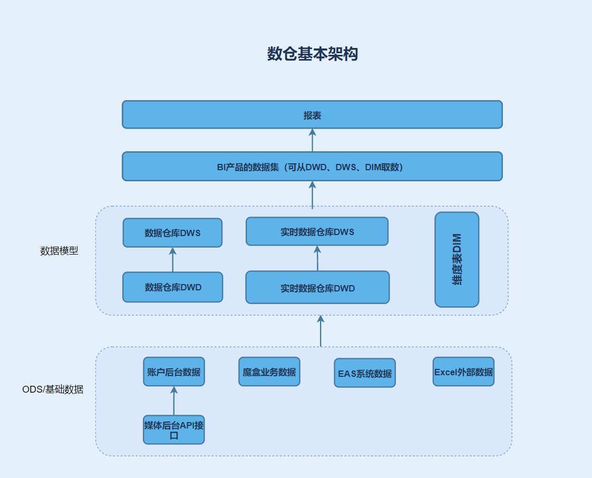

# 数据仓库的建设

## 一、现在的表设计

https://www.yuque.com/sacpec/dnin40/dbbfar#bQ6p

## 二、常见数仓分层设计

### ODS

基础数据，包括业务数据、外部数据等。

### DWD

按照不同的业务粒度，生成的不同粒度的宽表。例如：订单表，回款明细表，用户表等。

 1.  同一度量是否要在多个不同的宽表上做冗余字段？如果要做的话要做多少？例如：回款明细表中的回款金额，既可以放到明细表上，又可以放到用户表上。放到其他表上虽然依然是回款金额，但是其含义有所不同。
 2.  延续上一个问题，维度是否要冗余？例如：订单上有很多维度，门店、渠道等。如果想按照门店和渠道去看回款的话，是在回款明细中增加对应的维度，还是关联订单表再取对应的维度。
 3.   实时用何种方式实现？是单独拿出来？还是保证所有的DWD都是实时的？

A:实时的是单独的。

### DWS

在DWD的基础上，对DWS进行一定程度的汇总，使得报表能够更快速的展现出来。
DWS本身是否也可以分出几个层次；轻度聚合和重度聚合。

1. 是否可以同一粒度的冗余看作是一种轻型的DWS？
2. DWS重度聚合要到什么程度？

## 三、数据仓库的管理

当前使用表设计作为数云内数据模型的规范文档。
现在是按照业务条线对后台的表进行的区分，而不是按照表的粒度区分。比如订单的信息，有些在营销模块，有些在工程模块，由于当初开发计划的原因，没有对其做一个整合，而是各自对同一个字段重新进行的开发。

|    |  关联引用   |  单独开发   | 
| --- | --- | --- | 
|  **优点**|同一指标/维度只需开发一次，后续有用到的地方关联引用即可。比较统一。|各表之间依赖程度不高，方便调度| 
| **缺点**|表间依赖关系较重，更新逻辑需要注意，抽数时需要注意先后顺序|相同指标需要重复开发，更新指标逻辑后需要全部修改。| 

## 四、现在考虑到的几个问题

 1. 当前数云承载了花费、财务数据的一部分外部数据上传处理的任务，后续将其迁移到哪里？
 2. 数云对EAS有一套封装的处理逻辑，是成熟的产品，未来如何产生财务的报表？
 3. 如何在数仓中保证度量和维度的统一。
 4. 实时方案到底如何？是否严格区分离线和实时？
 5. 报表查询效率问题实际上就是计算过程往哪里放的问题；除部分必须在报表层上进行计算的报表，大多数都可以放到后台进行计算，最终计算结果在数仓内作为一张表的形式进行展示。
 6. 数仓的查询效率如何？能否进行优化？例如分区分表等操作，查询效率一直是用户诟病的一个问题。
 7. 对于前端BI的要求：实时、移动端、权限控制（行列控制，最好能对接现有系统权限）、即席查询。

