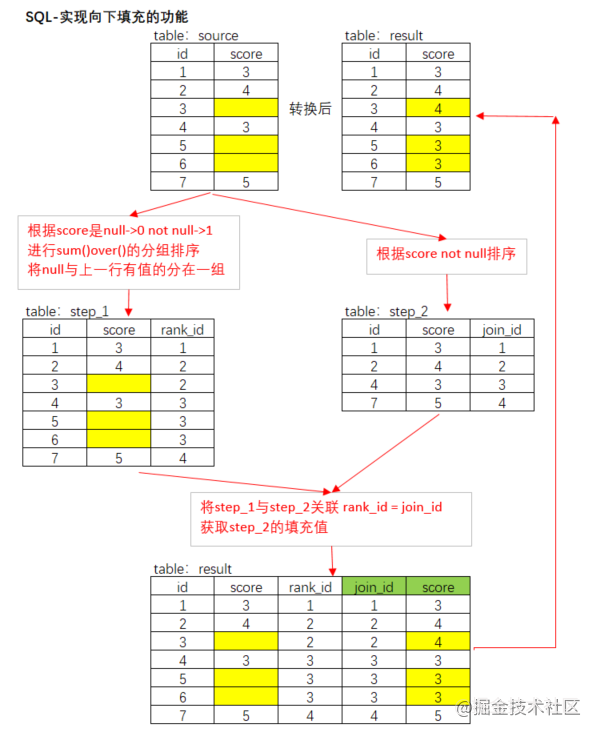
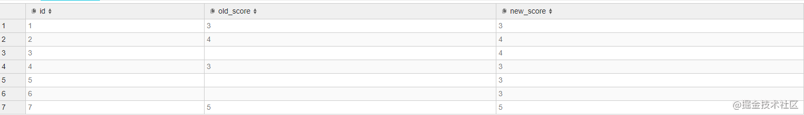

[toc!?direction=lr]

# sqlserver 动态计算
2019年02月28日 18时56分22秒


``` sql

--模拟数据
IF OBJECT_ID('tempdb..#t')>0 DROP TABLE #t
SELECT * INTO #t
FROM (
SELECT '1' id,2030 g,265 h, 830 k,'g*h+h*k' gs,0 tt
UNION ALL
SELECT '2' id,2030 g,0 h, 0 k,'g*4' gs,0 tt
UNION ALL
SELECT '3' id,2030 g,265 h, 0 k,'(g+h)*2' gs,0 tt
UNION ALL
SELECT '4' id,2030 g,265 h, 0 k,'(g+h)*2' gs,0 tt)t
--原始数据
SELECT * FROM #t


--按公式类别分类
IF OBJECT_ID('tempdb..#tt')>0 DROP TABLE #tt
SELECT ROW_NUMBER()OVER(ORDER BY gs)rowid 
,gs 
INTO #tt
FROM #t
GROUP BY gs


--变量
DECLARE @i int,@n INT
DECLARE @gs VARCHAR(50)
DECLARE @sql VARCHAR(MAX)
--按公式类别遍历
SELECT @i=MIN(rowid),@n=MAX(rowid) FROM #tt
WHILE(@i<=@n)
BEGIN
SELECT @gs=gs FROM #tt WHERE rowid=@i
SET @sql='update #t set tt='+@gs+' where gs='''+@gs+''''--生成脚本
EXEC(@sql)--执行脚本，可以print看效果
SET @i=@i+1
END
--处理后效果
SELECT * FROM #t

drop table #t
```
2019年03月15日 19时09分48秒
实际的动态计算
需要注意一下几点，@gs 变量的长度，一定要大于公式字段最长的长度。
第二个需要注意的点是，存放结果的字段一定要是够大的浮点型，如果是使用数字新建的话，可用 100000.0000 代替。
``` sql
  
  --模拟数据 
IF OBJECT_ID('tempdb..#t')>0 DROP TABLE #t 

SELECT 
a.store_no
,a.contract_no 
,a.contract_area
,a.real_area
,a.product_no  -- ' COMMENT '套餐编号[inco1]',
-- ,a.id -- ’设计空间实例id',
,a.design_case_no --   '设计实例编码',
,a.case_space_name --   '空间实例名',
,a.case_space_no --   '空间实例编码',
,a.space_no --   '空间编码',
,a.no -- '相同空间的编号(比如 WS1,WS2,WS3 后面的数字)',
,a.design_case_id -- '设计实例id',
,a.sort_val -- '排序',
,a.area BL_SCMJ-- '实测面积',
,a.girth BL_KJZC-- '周长',
,a.height BL_KJCG-- '层高',
,a.is_balcony -- '是否关联阳台:0:无,1:有',
,a.remain_area -- ’可用墙面积',
,a.state -- '1:已完成,2.未完成',
,a.relation_space_no --   '关联空间实例编码 ',
,a.added -- '1:户型外添加的空间 2:户型内的空间 ',
-- ,b.store_no                 
-- ,b.package_no               
-- ,b.cp_combo_name            
-- ,b.space_no                 
,b.work_item_no             
,b.work_item_name           
,b.dimension_no             
-- ,b.stand_choose             
-- ,b.dimension_name           
,b.dimension_val   
,c.bl_sgl bl_sgl_1
,case when c.bl_sgl = 'SCCG' then a.height*c.sgl_num when c.bl_sgl='SCZC' then a.girth*c.sgl_num when c.bl_sgl='SCQM' then a.remain_area*c.sgl_num when c.bl_sgl='SCMJ' then a.area*c.sgl_num else c.bl_sgl end BL_SGL
,c.sgl_num
,c.job_place
,c.job_place_no 
,d.goods_no
,d.goods_name
,d.category_no
,d.length JC_SKU_length
,d.width JC_SKU_width
,d.height goods_height
,d.base_unit
,d.normal_num -- 标配数量
,d.attrition_rate JC_SHL-- 损耗率
,d.function_content1 gs -- 施工量和用量转化公式    
, 10000000000.0000 tt
into #t
FROM
  Fact_Design_Case_Space a
LEFT JOIN dim_03_stand_package b ON a.store_no = b.store_no  -- 关联标准套餐表，出来标准套餐所需要的施工项
AND a.product_no = b.package_no
AND a.space_no = b.space_no
LEFT JOIN (select * from dim_03_stand_work_item where is_suit = 1) c -- 关联标准施工量，得到每个施工项的施工量。
ON b.work_item_no = c.work_item_no
LEFT JOIN Fact_Design_House_Space_Goods d -- 根据城市-施工项-选材维度确定商品
on a.store_no = d.store_no and b.work_item_no = d.work_item_no  and b.dimension_no  = d.dimension_no  
WHERE
  a.contract_no = 'DD20180602001060'

--原始数据 
SELECT * FROM #t 
 
 
 
 
--按公式类别分类 
IF OBJECT_ID('tempdb..#tt')>0 DROP TABLE #tt 
SELECT ROW_NUMBER()OVER(ORDER BY gs)rowid  
,gs  
INTO #tt 
FROM #t 
where gs is not null 
GROUP BY gs 
 select * from #tt
 
--变量 
DECLARE @i int,@n INT 
DECLARE @gs VARCHAR(100) 
DECLARE @sql VARCHAR(MAX) 
--按公式类别遍历 
SELECT @i=MIN(rowid),@n=MAX(rowid) FROM #tt 
WHILE(@i<=@n) 
BEGIN 
SELECT @gs=gs FROM #tt WHERE rowid=@i 
print @i
SET @sql='update #t set tt='+@gs+' where gs='''+@gs+''''--生成脚本 

print @sql

EXEC(@sql)--执行脚本，可以print看效果 
/*
*/
SET @i=@i+1 
END 

--处理后效果 
SELECT * FROM #t 
 
drop table #t
drop table #tt
-- 向上取整数 CEILING


select a.*,b.* from 
(select a.*,CEILINg(a.tt) as use_num from #t a) a
left join Fact_Sale_price b
on a.store_no=b.store_no and a.goods_no = b.goods_no

```

## 两种动态计算
使用exec和sp_executesql动态执行SQL语句（转载）
当需要根据外部输入的参数来决定要执行的SQL语句时，常常需要动态来构造SQL查询语句，个人觉得用得比较多的地方就是分页存储过程和执行搜索查询的SQL语句。一个比较通用的分页存储过程，可能需要传入表名，字段，过滤条件，排序等参数，而对于搜索的话，可能要根据搜索条件判断来动态执行SQL语句。

在SQL Server中有两种方式来执行动态SQL语句，分别是exec和sp_executesql。sp_executesql相对而言具有更多的优点，它提供了输入输出接口，可以将输入输出变量直接传递到SQL语句中，而exec只能通过拼接的方式来实现。还有一个优点就是sp_executesql，能够重用执行计划，这就大大提高了执行的性能。所以一般情况下建议选择sp_executesql来执行动态SQL语句。

使用sp_executesql需要注意的一点就是，它后面执行的SQL语句必须是Unicode编码的字符串，所以在声明存储动态SQL语句的变量时必须声明为nvarchar类型（如果不知道SQL语句有多长，可以直接用nvarchar(max)类型），否则在执行的时候会报“过程需要类型为 'ntext/nchar/nvarchar' 的参数 '@statement'”的错误，如果是使用sp_executesql直接执行SQL语句，则必须在前面加上大写字母N，以表明后面的字符串是使用Unicode类型编码的。

下面来看看几种动态执行SQL语句的情况

**1.普通SQL语句**
``` sql
exec('select * from Student')
exec sp_executesql N'select * from Student'--此处一定要加上N，否则会报错
```

**2.带参数的SQL语句**

``` sql
declare @sql nvarchar(1000)
declare @userId varchar(100)
set @userId='0001'
set @sql='select * from Student where UserID='''+@userId+''''
exec(@sql)
```
``` sql
declare @sql nvarchar(1000)
declare @userId varchar(100)
set @userId='0001'
set @sql=N'select * from Student where UserID=@userId'
exec sp_executesql @sql,N'@userId varchar(100)',@userId
```
从这个例子中可以看出使用sp_executesql可以直接将参数写在sql语句中，而exec需要使用拼接的方式，这在一定程度上可以防止SQL注入，因此sp_executesql拥有更高的安全性。另外需要注意的是，存储sql语句的变量必须声明为nvarchar类型的。


**3.带输出参数的SQL语句**


``` sql
create procedure [dbo].[sp_GetNameByUserId]
(
    @userId varchar(100),
    @userName varchar(100) output
)
as
begin

    declare @sql nvarchar(1000)
    set @sql=N'select @userName=UserName from Student where UserId=@userId'
    exec sp_executesql @sql,N'@userId varchar(100),@userName varchar(100) output',@userId,@userName output
    select @userName

end
```
**4.将执行的sql结果传出来**
``` sql
declare @sql nvarchar(2000) 
declare @cou int 
declare @id varchar(20) 
set @id='101' 
set @sql='select @count=count(*) from dim_area where area_code=@id' 
exec sp_executesql @sql, N'@count int out,@id varchar(20)', @cou out ,@id 
print @cou 


```
注意： 
1. sp_executesql要求动态Sql和动态Sql参数列表必须是Nvarchar，比如上个例子的@sql,N'@count int out,@id varchar(20)'我记得在sql2005中Varchar也可以的，但是我打了Sp3补丁后就不行了，必须为Nvarchar 
2. 动态Sql的参数列表与外部提供值的参数列表顺序必需一致，如： 
N'@count int out,@id varchar(20)', @cou out,@id 
@count 对应 @cou,@id对应@id 
如果不一致，必须显式标明，如： 
N'@count int out,@id varchar(20)', @id＝@id, @count=@cou out 
3. 动态SQl的参数列表与外部提供参数的参数列表参数名可以同名
**4. 如果参数是表名、group by 的参数的话，需要放在外面。否则会报错**
``` 
Procedure execution failed
42000 - [SQL Server]Must declare the table variable "@id".

查询时间: 00:00.07
```
```sql
set @sql='select @count=count(*) from dim_area where area_code='+@id
```
详细解析见：
https://blog.csdn.net/hisense20112784/article/details/72884516

## 重复数据检查

``` sql
DECLARE @start_num int,@end_num int ,@cou int
DECLARE @table_name nvarchar(100),@primary_column nvarchar(100)
DECLARE @sql nvarchar(MAX)


-- 创建临时表并排序
IF OBJECT_ID('tempdb..#fuc')>0 DROP TABLE #fuc
SELECT ROW_NUMBER()OVER(ORDER BY table_name) rowid 
	,table_name 
	,primary_column
INTO #fuc
FROM Fact_Uniqueness_Check


select @start_num=min(rowid), @end_num = max(rowid) from #fuc

while(@start_num<=@end_num)
begin
    
	select @table_name=table_name,@primary_column=primary_column from #fuc where rowid = @start_num

	set @sql='select @count=count(1) from (select @primary_column as t_col from '+@table_name+' group by '+@primary_column+' HAVING count(1) > 1) a'
	exec sp_executesql @sql, N'@count int out, @table_name nvarchar(100),@primary_column nvarchar(100)',@cou out,@table_name,@primary_column

	if @cou = 0
			begin
					exec('update Fact_Uniqueness_Check set state = ''不重复'' where table_name = '''+@table_name+''''  )
					exec('update Fact_Uniqueness_Check set check_date = getdate() where table_name = '''+@table_name+''''  )
			end 
			else 
			begin
					exec('update Fact_Uniqueness_Check set state = ''有重复'' where table_name = '''+@table_name+''''  )
					exec('update Fact_Uniqueness_Check set check_date = getdate() where table_name = '''+@table_name+''''  )
			end

	set @start_num = @start_num + 1

end


```


# sqlserver decimal转为varchar
因为 decimal 格式的有小数位，cast 函数只能将他变成 10.0000 的形式，因此还需要替换掉的后面的。
``` sql
select replace(cast(101.00000000 as varchar(100)),'.00000000','') store_no 
```
# mysql 组内分组排序
``` sql


SELECT
  a.*, count(1) AS rank
FROM
  (select 1 as id,'aaa' as name ,1 as category_id union all
select 2 as id,'bbb' as name ,2 as category_id union all
select 3 as id,'ccc' as name ,1 as category_id union all
select 4 as id,'ddd' as name ,2 as category_id union all
select 5 as id,'eee' as name ,1 as category_id 
) a
LEFT JOIN (select 1 as id,'aaa' as name ,1 as category_id union all
select 2 as id,'bbb' as name ,2 as category_id union all
select 3 as id,'ccc' as name ,1 as category_id union all
select 4 as id,'ddd' as name ,2 as category_id union all
select 5 as id,'eee' as name ,1 as category_id 
) b ON a.category_id = b.category_id
AND a.id <= b.id
GROUP BY
  a.category_id,
  a.id
ORDER BY
  a.category_id,
  a.id DESC


SELECT
  *
FROM
  (select 1 as id,'aaa' as name ,1 as category_id union all
select 2 as id,'bbb' as name ,2 as category_id union all
select 3 as id,'ccc' as name ,1 as category_id union all
select 4 as id,'ddd' as name ,2 as category_id union all
select 5 as id,'eee' as name ,1 as category_id 
) a
LEFT JOIN (select 1 as id,'aaa' as name ,1 as category_id union all
select 2 as id,'bbb' as name ,2 as category_id union all
select 3 as id,'ccc' as name ,1 as category_id union all
select 4 as id,'ddd' as name ,2 as category_id union all
select 5 as id,'eee' as name ,1 as category_id 
) b ON a.category_id = b.category_id
AND a.id >= b.id
where a.category_id = 1
GROUP BY
  a.category_id,
  a.id

``` 
# mysql分组后取组内某列最小（大）的行
此问题是由于工作中之前在sqlserver中是使用的 分组后排序，然后取rank=1的，从而得到分组后的某列极值的。但是mysql中分组后排序的机制太过复杂（关联后count数量），特别是大数量的时候会极度的影响效率，再加上我最核心的需求实际上可以总结为**每个用户的创建时间最早的一行数据**，因此在之前的路走不通的情况下寻求其他的办法。
``` sql
-- 返回每个用户的创建时间最早的订单编号
-- step 1 首先根据时间排序

select * from fact_decorate_order order by concat(DATE(create_date),' ',TIME(create_time));

-- step 2 根据用户编号分组
-- 注意，此时mysql5.7 以上的话需要加limit，要不然会有问题。

select a.*,'1' rank from (
select * from fact_decorate_order order by concat(DATE(create_date),' ',TIME(create_time))
-- limit 100
) a
group by user_id 
```
## 思路更新

最近在有需求取最早的订单编号，想了一下可能不需要现在这么复杂，只需要找出最大或者最小的ID，然后使用原表来关联（使用ID  in 也可以，但是数据量大的时候join效率更高）此id，再加个条件不为空，既能得到想要的最大（小）的值那行的信息。
``` sql

select user_id,orders_no from fact_decorate_order fdo
left join (
  select min(id) id from fact_decorate_order
  group by user_id 
) fdoId on fdo.id=fdoId.id
where fdoId.id is not null 
```

# mysql使用 in 子查询效率低下
mysql直接使用in (select user_id from table) 时效率会超级超级超级慢，具体原理暂且不论，可以在外面再套一层，这样的话查询速度就会变正常。
``` sql
select * 
from table_A
where user_id in (
  select user_id
  from (
    select user_id 
    from table_B
  ) temp
)
```
# mysql 大量数据关联查询
大量数据（百万）表间关联的时候，查询速度会特别的慢，此时需要在关联字段上创建索引，会极大的提高查询效率。
但是有多个大表关联的时候，即便建立了索引查询效率依然很低，此时需要了解mysql中驱动表的概念。最外层的表，也就是left join 最左边的表就是驱动表，查询的效率与驱动表的行数有关，行数越低查询效率越高。
因此遇到那种百万级别的主表取进行关联的时候，可以分组进行关联。如下。

``` sql
    WHILE i < num DO

        insert into Fact_Decorate_Order_Std
          SELECT
          *
        FROM  (select * from Fact_Decorate_Order where id >= i and id < i+100000) a 
        LEFT JOIN T71 b ON a.user_id = b.user_id
        LEFT JOIN T72 c ON a.orders_no = c.fk_docr_orders_no 
        left join  T6 e on a.orders_no = e.orders_no -- 20190304 订单明细标准表增加调整的时间，之前只是用户穿刺表处理了时间
        left join dim_01_contract_tag f
        on a.orders_no = f.orders_no ;

        SET i = i + 100000 ;

    END WHILE ;
```
按照id每次抽一万条。

# 同结构多关联查询问题

  我们的订单数据结构目前是以订单为核心的，所有阶段的时间都记录在一条信息上，这样的话如果我想要取用某天实际的各阶段的数据的时候，就需要每个阶段都建立一个查询，分别查出每个阶段需要使用的数据，然后关联在一起。
    实际使用过程中每次都需要关联表格效率太低，因此想做一张类似已经查询完的结果表的表放在那里，这样的话使用起来会比较方便。
  在实际操作中遇到了一点疑问，就是每个阶段的维度不一定是相同的，我们需要取全连接的所有数据，并且把空的维度进行替换，两张表的时候没有任何问题，但是随着阶段的增多，当增加到三张表的时候就会出现问题，如果 a full join b full join c ，那么c的关联条件怎么做?
  现阶段我能想到的解决办法就是  a先与b关联做出一个子查询然后和c关联。

- 验证sql如下（sqlserver环境）
``` sql
select 'A' as apt
      ,'甲' as name 
      ,1 as num_1
into temp_1

insert into temp_1 values('B','乙',2);

select 'B' as apt
      ,'乙' as name 
      ,3 as num_2
into temp_2

insert into temp_2 values('C','丙',4);

select 'C' as apt
      ,'丁' as name 
      ,5 as num_3
into temp_3

insert into temp_3 values('D','戊',6);
insert into temp_3 values('A','甲',7);
insert into temp_3 values('C','丙',8);
-- 不能正常合并的方法
select *
from temp_1 full join temp_2 on temp_1.apt=temp_2.apt and temp_1.name=temp_2.name
full join temp_3 on temp_1.apt=temp_3.apt and temp_1.name=temp_3.name 

-- 现有方法
select case when temp_1.apt is null then temp_3.apt else temp_1.apt end apt
          ,case when temp_1.name is null then temp_3.name else temp_1.name end name 
          ,temp_1.num_1
          ,temp_1.num_2 
          ,temp_3.num_3
from 
(
    select case when temp_1.apt is null then temp_2.apt else temp_1.apt end apt
          ,case when temp_1.name is null then temp_2.name else temp_1.name end name 
          ,temp_1.num_1
          ,temp_2.num_2
    from temp_1 full join temp_2 on temp_1.apt=temp_2.apt and temp_1.name=temp_2.name
) temp_1
full join temp_3 on temp_1.apt=temp_3.apt and temp_1.name=temp_3.name 


drop table if EXISTS temp_1;
drop table if EXISTS temp_2;
drop table if EXISTS temp_3;
``` 
# 相关子查询和非相关子查询（可实现累加）


子查询：嵌套在其它查询中的查询语句。（又称为内部查询）

主查询：包含其它子查询的查询称为主查询。（又称外部查询）

 

子查询分为两类：

相关子查询
非相关子查询
在主查询中，每查询一条记录，需要重新做一次子查询，这种称为相关子查询。

在主查询中，子查询只需要执行一次，子查询结果不再变化，供主查询使用，这种查询方式称为非相关子查询。


 ``` sql
 
  -- 相关子查询
SELECT sname
FROM student
WHERE sex = ‘女’ AND
EXISTS ( SELECT  *         //相关子查询
FROM sc
WHERE sc.sno = student.sno AND
sc.cno LIKE ‘ee%’);
 
 
 -- 非相关子查询  
 
 SELECT sname
FROM student
WHERE sex = ‘女’ AND
sno IN ( SELECT DISTINCT sno       //不相关子查询
FROM sc
WHERE cno LIKE ‘ee%’);


-- 实际用到的子查询 实现了累加的功能  实际是一个相关子查询
-- 在mysql中实现了累加
SELECT
  (
    SELECT
      sum(

        IF (
          payment_category IN (6, 7, 11, 13),
          payment_amount *- 1,
          payment_amount
        )
      )
    FROM
      decorate_order_pay b
    WHERE
      b.orders_no = a.orders_no
    AND b.id * 1 <= a.id * 1
  ) sumnum,
  a.*
FROM
  decorate_order_pay a
WHERE
  orders_no = 'DD20181202000485'
 ```
sqlserver中实现分组累加要方便许多。有函数可以直接使用。

``` sql
select 
sum(payment_amount) over(partition by orders_no order by create_time)
 from fact_decorate_order_pay 
where orders_no ='DD20181202000485'

```
eg. 计算阶梯价格的方案。
``` sql
drop table if exists dim_goods_gppd;

with subtract as (
select 
sum(dggb.sum_price) over(partition by dggb.product_price_id order by dggb.sort desc) as subtract_cumsum --应减金额
,dggb.*
from dim_goods_gppd_base dggb
where  dggb.price_type = 2
),
plus as (
select 
sum(dggb.sum_price) over(partition by dggb.product_price_id order by dggb.sort) as plus_cumsum -- 应加金额
,dggb.*
from dim_goods_gppd_base dggb
where  dggb.price_type = 1
),
dggb as (
select
dggb.product_price_id -- 售卖套餐id
,dggb.product_no
,dggb.area_code
,dggb.id -- 价表明细ID
,dggb.start_area -- 明细起始面积
,dggb.end_area -- 明细终止面积
,dggb.price_type -- 超平米售价类型 1+ 2-
,dggb.price -- 价格
,dggb.sum_price -- 区间价格
,dggb.sort -- 排序值
,dggb.create_time -- 创建时间
,dggb.update_time -- 最后更新时间
from dim_goods_gppd_base dggb
)
select 
dggb.product_price_id -- 售卖套餐id
,dggb.product_no
,dggb.area_code
,dggb.id -- 价表明细ID
,dggb.start_area -- 明细起始面积
,dggb.end_area -- 明细终止面积
,dggb.price_type -- 超平米售价类型 1+ 2-
,dggb.price -- 价格
,dggb.sum_price -- 区间价格
,isnull(subtract.subtract_cumsum,0) as subtract_cumsum --应减金额 -- 应减价格
,isnull(plus.plus_cumsum,0) as plus_cumsum -- 应加金额 -- 应加价格
,dggb.sort -- 排序值
,dggb.create_time -- 创建时间
,dggb.update_time -- 最后更新时间
into dim_goods_gppd
from dggb 
left join subtract on dggb.product_price_id = subtract.product_price_id and dggb.sort = subtract.sort-1
left join plus on dggb.product_price_id = plus.product_price_id and dggb.sort = plus.sort+1

```


# sqlserver中游标的使用

现在有一个链接地址处理的问题，有多个链接中的特定字符需要替换成多个城市的缩写。
考虑使用嵌套循环的方式处理，但是sql中没有类似python中的列表，没办法临时存储，经过查询资料发现sql解决这个问题的办法是创建索引，使用索引作为临时存储的容器。

``` sql

DECLARE @i int
DECLARE @area VARCHAR (10)
set @i = 0
SET @area = 'area' -- 创建游标
DECLARE area_cursor CURSOR FOR (    select 'bj' as area union   select 'sh' as area union   select 'sz' as area union   select 'szh' as area union    select 'cd' as area union   select 'tj' as area union   select 'ty' as area union   select 'gz' as area union   select 'gy' as area union   select 'wh' as area union   select 'jn' as area union   select 'xa' as area union   select 'lf' as area union   select 'zz' as area union   select 'nj' as area union   select 'nc' as area 
) --打开游标--
OPEN area_cursor 
--开始循环游标变量--
FETCH NEXT FROM area_cursor INTO @area


-- 创建临时表
drop table if exists #stand_url_temp

create table #stand_url_temp(
entry_url nvarchar(256),
source_no nvarchar(10)
)

WHILE @@FETCH_STATUS = 0 --返回被 FETCH语句执行的最后游标的状态--
  BEGIN
    insert into #stand_url_temp
      select REPLACE(entry_url, '*',@area) ,source_no from (
          select 'http://*.ikongjian.com/' as entry_url,'790001' as source_no union
          select 'http://*.ikongjian.com/reservation/index%' as entry_url,'790001' as source_no union
          select 'http://m.ikongjian.com/*/reservation/index%' as entry_url,'790002' as source_no union
          select 'http://m.ikongjian.com/' as entry_url,'790002' as source_no union
          select 'http://m.ikongjian.com/*/' as entry_url,'790002' as source_no union
          select 'https://m.ikongjian.com/*/changeCity' as entry_url,'790002' as source_no union
          select 'https://m.ikongjian.com/*/liveOffice/%' as entry_url,'790002' as source_no union
          select 'http://*.ikongjian.com/liveOffice/%' as entry_url,'790001' as source_no union
          select 'http://*.ikongjian.com/construction/' as entry_url,'790001' as source_no union
          select 'http://*.ikongjian.com/hotHouse/index' as entry_url,'790001' as source_no union
          select 'http://*.ikongjian.com/cooperation/tequan' as entry_url,'790001' as source_no union
          select 'http://*.ikongjian.com/kujiale/p/index' as entry_url,'790001' as source_no union
          select 'http://*.ikongjian.com/news/%' as entry_url,'790001' as source_no union
          select 'http://*.ikongjian.com/case/%' as entry_url,'310101' as source_no union
          select 'http://www.ikongjian.com/zixun/%' as entry_url,'310101' as source_no union
          select 'http://www.ikongjian.com/wen/%' as entry_url,'310101' as source_no union
          select 'http://www.ikongjian.com/tu/%' as entry_url,'310101' as source_no union
          select 'https://m.ikongjian.com/zixun/%' as entry_url,'310102' as source_no union
          select 'https://m.ikongjian.com/wen/%' as entry_url,'310102' as source_no union
          select 'https://m.ikongjian.com/tu/%' as entry_url,'310102' as source_no union
          select 'https://m.ikongjian.com/*/case/%' as entry_url,'310102' as source_no union
          select 'http://m.ikongjian.com/*/ikj/%' as entry_url,'790003' as source_no union
          select 'https://*.ikongjian.com/ikj/%' as entry_url,'790003' as source_no union
          select 'https://m.ikongjian.com/*/activitys/%' as entry_url,'790003' as source_no union
          select 'https://*.ikongjian.com/ activitys/%' as entry_url,'790003' as source_no 
    ) stand_url
      where entry_url like '%*%'

  FETCH NEXT  FROM    area_cursor INTO @area --转到下一个游标，没有会死循环
  END 

CLOSE area_cursor --关闭游标
DEALLOCATE area_cursor --释放游标

insert into  #stand_url_temp
select entry_url,source_no
from (
  select 'http://*.ikongjian.com/' as entry_url,'790001' as source_no union
  select 'http://*.ikongjian.com/reservation/index%' as entry_url,'790001' as source_no union
  select 'http://m.ikongjian.com/*/reservation/index%' as entry_url,'790002' as source_no union
  select 'http://m.ikongjian.com/' as entry_url,'790002' as source_no union
  select 'http://m.ikongjian.com/*/' as entry_url,'790002' as source_no union
  select 'https://m.ikongjian.com/*/changeCity' as entry_url,'790002' as source_no union
  select 'https://m.ikongjian.com/*/liveOffice/%' as entry_url,'790002' as source_no union
  select 'http://*.ikongjian.com/liveOffice/%' as entry_url,'790001' as source_no union
  select 'http://*.ikongjian.com/construction/' as entry_url,'790001' as source_no union
  select 'http://*.ikongjian.com/hotHouse/index' as entry_url,'790001' as source_no union
  select 'http://*.ikongjian.com/cooperation/tequan' as entry_url,'790001' as source_no union
  select 'http://*.ikongjian.com/kujiale/p/index' as entry_url,'790001' as source_no union
  select 'http://*.ikongjian.com/news/%' as entry_url,'790001' as source_no union
  select 'http://*.ikongjian.com/case/%' as entry_url,'310101' as source_no union
  select 'http://www.ikongjian.com/zixun/%' as entry_url,'310101' as source_no union
  select 'http://www.ikongjian.com/wen/%' as entry_url,'310101' as source_no union
  select 'http://www.ikongjian.com/tu/%' as entry_url,'310101' as source_no union
  select 'https://m.ikongjian.com/zixun/%' as entry_url,'310102' as source_no union
  select 'https://m.ikongjian.com/wen/%' as entry_url,'310102' as source_no union
  select 'https://m.ikongjian.com/tu/%' as entry_url,'310102' as source_no union
  select 'https://m.ikongjian.com/*/case/%' as entry_url,'310102' as source_no union
  select 'http://m.ikongjian.com/*/ikj/%' as entry_url,'790003' as source_no union
  select 'https://*.ikongjian.com/ikj/%' as entry_url,'790003' as source_no union
  select 'https://m.ikongjian.com/*/activitys/%' as entry_url,'790003' as source_no union
  select 'https://*.ikongjian.com/ activitys/%' as entry_url,'790003' as source_no 
) stand_url
where entry_url not like '%*%'


```
# sqlserver中字符串转日期和日期转字符串
```
select convert(date,GETDATE() ,102) -- 字符串转日期 -- 还可以作为去掉时间，只保留日期功能使用
select convert(varchar(10),GETDATE() ,102) -- 日期转字符串
```
# sqlserver中取周初周末的日期

``` sql

-- 首先将当前日期减一,因为sqlserver默认从周日开始一周，如果我们需要周一开始的话需要减一
-- 然后计算从计算机0开始到现在有多少周
-- 再然后从零时间加上面取出来的周。即为周初
-- 再然后6代表第七天的时间加上面取出来的周。即为周末
select DATEADD(wk, DATEDIFF(wk,0,DATEADD(dd, -1, '2019-11-08') ), 0)

-- 假如你要计算这个季度的第一天，这个例子告诉你该如何做。
　SELECT DATEADD(qq, DATEDIFF(qq,0,getdate()), 0)
```

# sqlserver 查看各表大小

``` sql
drop table if EXISTS  #Data
drop table if EXISTS  #DataNew

create table #Data(name varchar(100),row varchar(100),reserved varchar(100),data varchar(100),index_size varchar(100),unused varchar(100)) 
 
declare @name varchar(100) 
declare cur cursor  for 
    select name from sysobjects where xtype='u' order by name 
open cur 
fetch next from cur into @name 
while @@fetch_status=0 
begin 
    insert into #data 
    exec sp_spaceused   @name 
    print @name 
 
    fetch next from cur into @name 
end 
close cur 
deallocate cur 
 
create table #DataNew(name varchar(100),row int,reserved int,data int,index_size int,unused int) 
 
insert into #dataNew 
select name,convert(int,row) as row,convert(int,replace(reserved,'KB','')) as reserved,convert(int,replace(data,'KB','')) as data, 
convert(int,replace(index_size,'KB','')) as index_size,convert(int,replace(unused,'KB','')) as unused from #data  
 


select * from #dataNew order by data desc

drop table if EXISTS  #Data
drop table if EXISTS  #DataNew

```

# 数据库的思路

关于增加上传日期的问题，可以从数据库表本身的可用功能的思路去想，不必修改现有的上传逻辑等。
给需要上传时间的表增加一列时间，给该列一个默认值为当前时间，当上传的时候，会自动添加上传时间。
sqlserver下语句如下。

 ``` sql
 alter table fact_eas_adjustment_upload_temp add AddDate datetime default GETDATE()
``` 
# mysql 实现累加
``` sql
    select 
      (select sum(if(payment_category in (6,7,11,13),payment_amount*-1,payment_amount)) from www.decorate_order_pay b where b.orders_no = a.orders_no and b.id*1<=a.id*1) CUSUM
      -- 2019年8月8日 shg 以下为 累加字段的标记字段，用作后续判断
      ,if((select sum(if(payment_category in (6,7,11,13),payment_amount*-1,payment_amount)) from www.decorate_order_pay b where b.orders_no = a.orders_no and b.id*1<=a.id*1)>=500,1,0) CUSUM_sign
      -- 2019年11月19日 shg  之前的判断逻辑有误，会取到首次交钱不满500的作为首次退订至不满五百的时间。
      -- 新增交定数：期初金额=(回款明细当前余额 减 回款明细当前金额 ) < 500   & 回款明细当前余额 >=500
      -- 新减交定数：期初金额=(回款明细当前余额 减 回款明细当前金额 ) >= 500   & 回款明细当前余额 >500
      ,case when (select sum(if(payment_category in (6,7,11,13),payment_amount*-1,payment_amount)) from www.decorate_order_pay b where b.orders_no = a.orders_no and b.id*1<=a.id*1) - if(payment_category in (6,7,11,13),payment_amount*-1,payment_amount) < 500 and
       (select sum(if(payment_category in (6,7,11,13),payment_amount*-1,payment_amount)) from www.decorate_order_pay b where b.orders_no = a.orders_no and b.id*1<=a.id*1) >= 500 then 1 else 0 end  as new_payment_state
      ,case when (select sum(if(payment_category in (6,7,11,13),payment_amount*-1,payment_amount)) from www.decorate_order_pay b where b.orders_no = a.orders_no and b.id*1<=a.id*1) - if(payment_category in (6,7,11,13),payment_amount*-1,payment_amount) >= 500 and
       (select sum(if(payment_category in (6,7,11,13),payment_amount*-1,payment_amount)) from www.decorate_order_pay b where b.orders_no = a.orders_no and b.id*1<=a.id*1) < 500 then 1 else 0 end  as new_un_payment_state
      ,a.*
    from www.decorate_order_pay  a
    -- where orders_no = 'DD20180518000839'
    order by orders_no,create_time 

```
# sql关联的附表的过滤

之前使用sql关联附表的时候，如果只需要附表中的部分信息的话，我会使用子查询先将部分信息筛选出来，然后用该子查询的查询结果再与主表关联。这样的话会对查询效率有些影响。
今天看到了其他人写的sql，她的关联条件中增加了过滤，即下代码框中的
**left join dim_area b on a.area_code = b.area_code and b.city = '西安'**
 没想到可以直接放到关联字段之后，好用。之前竟然都不知道。

``` sql
select a.orders_no,b.*  from fact_decorate_order_std  a
left join dim_area b on a.area_code = b.area_code and b.city = '西安'
where user_id = '1043087'

```
# sqlserver 临时表清理

使用存储过程方式来实现临时表的清理。

```
ALTER PROCEDURE [dbo].[PF_ETL_Clear_TempTable]
AS
BEGIN 

  DECLARE @name VARCHAR(100)
  DECLARE @sql VARCHAR(MAX) 

  DECLARE TableNameCursor CURSOR FOR 
  SELECT NAME FROM SYSOBJECTS WHERE XTYPE='U' and name like 'BI%' ORDER BY NAME
  
  -- 打开游标 
  OPEN TableNameCursor
  fetch next from TableNameCursor into @name 
  WHILE @@fetch_status = 0 
  BEGIN
  
    set @sql = 'drop table '+@name
    print @sql
    exec(@sql)
    fetch next from TableNameCursor into @name 

  END

  
  -- 关闭游标
  CLOSE TableNameCursor
  deallocate TableNameCursor 

  -- drop table BI_1_1_G1_120900029263CE
END
```


 # mysql获取工作日的函数
 
 ``` sql
 
 CREATE FUNCTION `workDayNums`(beginDate datetime,endDate datetime) RETURNS int(11)
BEGIN
  DECLARE return_val INT DEFAULT 0 ;
  DECLARE tempDate datetime ;
  addDay :
  LOOP
    IF endDate is NULL OR beginDate is NULL THEN
        LEAVE addDay ;
    END IF ;
    IF tempDate IS NULL THEN
        SET tempDate = beginDate ;
    END IF ;
    IF DATEDIFF(endDate, tempDate) < 0 THEN
        LEAVE addDay ;
    END IF ;
    IF WEEKDAY(tempDate) = 5 OR WEEKDAY(tempDate) = 6 THEN
        SET return_val = return_val + 1 ;
    END IF ;
    SET tempDate = DATE_ADD(tempDate, INTERVAL 1 DAY) ;
  END LOOP addDay ;
  SET return_val = DATEDIFF(endDate, beginDate) + 1- return_val ;
  RETURN (return_val) ;
END

 ```
 
# with as 子查询
  WITH AS短语，也叫做子查询部分（subquery factoring），可以让你做很多事情，定义一个SQL片断，该SQL片断会被整个SQL语句所用到。有的时候，是为了让SQL语句的可读性更高些，也有可能是在UNION ALL的不同部分，作为提供数
据的部分
  在学习hive的过程中，别人的代码里面用到了 with as ，此语法为 sql 通用语法，实际上就是子查询，但是当子查询过多的时候方便管理，示例如下。
  https://www.cnblogs.com/zsan/p/8655456.html
  
``` sql
with 
t1 AS (
  select 1001 as no,'zhang' as name 
),
t2 AS (
  select 1001 as no,'sale' as dept 
)
select * from t1 left join t2 on t1.no = t2.no

```

# sqlserver 半全角字符不敏感

处理数据过程中发现，当使用含有半全角的字段进行关联的时候会出现重复关联的情况。

``` sql
select *
from(
  select '大宝v974（北京）有限公司' as account
  union ALL
  select '大宝v974(北京)有限公司' as account
) a
left join Dim_Account_Agent_Mapping daam
on a.account = daam.account 

```
结果如下，每一个都关联了两次。

| account         | tableB\_account | id |
|-----------------|-----------------|----|
| 大宝v974（北京）有限公司   | 大宝v974\(北京\)有限公司 | 1  |
| 大宝v974（北京）有限公司   | 大宝v974（北京）有限公司   | 28 |
| 大宝v974\(北京\)有限公司 | 大宝v974\(北京\)有限公司 | 1  |
| 大宝v974\(北京\)有限公司 | 大宝v974（北京）有限公司   | 28 |

解决方法如下，

``` sql
select *
from(
  select '大宝v974（北京）有限公司' as account
  union ALL
  select '大宝v974(北京)有限公司' as account
) a
left join Dim_Account_Agent_Mapping daam
on a.account = daam.account  collate Chinese_PRC_CI_AS_WS

```

| account         | tableB\_account | id |
|-----------------|-----------------|----|
| 大宝v974（北京）有限公司   | 大宝v974（北京）有限公司   | 28 |
| 大宝v974\(北京\)有限公司 | 大宝v974\(北京\)有限公司 | 1  |


在关联条件后增加 collate Chinese_PRC_CI_AS_WS ，需要注意的是，这个是要放到关联条件后的，放到语句的最后是不生效的。

``` sql
-- 错误示例
select 
*
from Fact_Cost_Zhongmeng a
left join Dim_Account_Agent_Mapping daam
  on a.账户 = daam.account and a.日期 >= daam.start_date and a.日期 <= daam.end_date
collate Chinese_PRC_CI_AS_WS 
-- 正确示例
select 
*
from Fact_Cost_Zhongmeng a
left join Dim_Account_Agent_Mapping daam
  on a.账户 = daam.account collate Chinese_PRC_CI_AS_WS 
  and a.日期 >= daam.start_date and a.日期 <= daam.end_date

``` 
# sqlserver 字符串处理

``` sql
SELECT
	reverse(
		SUBSTRING (
			reverse(
				'今日头条_20200407_爱空间科技（北京）有限公司-橙乐1'
			),
			0,
			charindex(
				'_',
				reverse(
					'今日头条_20200407_爱空间科技（北京）有限公司-橙乐1'
				)
			)
		)
	) -- 先倒序，倒过来之后取开始到首次出现下划线的位置，再将结果倒叙

-- 结果为  爱空间科技（北京）有限公司-橙乐1
-- 另外一种做法
SUBSTRING (
	reverse(
		SUBSTRING (
			reverse(今日头条_20200407_爱空间科技（北京）有限公司-橙乐1.xlsx),
			0,
			charindex('_', reverse(今日头条_20200407_爱空间科技（北京）有限公司-橙乐1.xlsx))
		)
	),
	0,
	charindex(
		'.xlsx',
		reverse(
			SUBSTRING (
				reverse(今日头条_20200407_爱空间科技（北京）有限公司-橙乐1.xlsx),
				0,
				charindex('_', reverse(今日头条_20200407_爱空间科技（北京）有限公司-橙乐1.xlsx))
			)
		)
	)
) AS account
```

# SQL窗口函数
引用自[原文地址](https://zhuanlan.zhihu.com/p/92654574)

## 一、窗口函数有什么用？

在日常工作中，经常会遇到需要在**每组内排名**，比如下面的业务需求：

>排名问题：每个部门按照业绩来排名
>topN问题：找出每个部门排名前N的员工进行奖励。

面对这类需求，就需要使用sql的高级窗口函数了。

## 二、什么是窗口函数？

窗口函数，也叫OLAP函数（Online Anallytical Processing，练级分析处理），可以对数据库数据进行实时分析处理。

窗口函数的基本语法如下：

>  <窗口函数>over(partition by <用于分组的列名> order by <用于排序的列名>)

那么语法中的<窗口函数>有哪些呢？

<窗口函数> 的未知，可以放以下两种函数：

1. 专用窗口函数，包括后面要讲到的rank、dense_rank、row_number 等专用窗口函数。
2. 聚合函数，如sum、avg、count、max、min等。

因为窗口函数是对where或者group by 子句处理后的结果进行操作，所以**窗口函数原则上只能写在select子句中**。

## 三、如何使用？

接下来结合实例查看集中窗口函数的用法。

### 1.专用窗口函数rank

例如下表，是班级表中的内容。

| 学号   | 班级 | 成绩 |
|------|----|----|
| 0001 | 1  | 86 |
| 0002 | 1  | 95 |
| 0003 | 2  | 89 |
| 0004 | 1  | 83 |
| 0005 | 2  | 86 |
| 0006 | 3  | 92 |
| 0007 | 3  | 86 |
| 0008 | 1  | 88 |

如果我们想在每个班级内按照成绩排名，得到下面效果。

| 学号 | 班级 | 成绩 | 排名 |
|----|----|----|----|
| 2  | 1  | 95 | 1  |
| 8  | 1  | 88 | 2  |
| 1  | 1  | 86 | 3  |
| 4  | 1  | 83 | 4  |
| 3  | 2  | 89 | 1  |
| 5  | 2  | 86 | 2  |
| 6  | 3  | 92 | 1  |
| 7  | 3  | 86 | 2  |

得到上面结果的sql语句代码如下：

``` sql
select *,
	rank()over(partition by 班级 
						order by 成绩 desc ) as ranking 
from 班级表 ;

```
我们姐是以下这个sql里面的select子句。rank 是排序函数，要求是“每个班级内按成绩排名”，这句话可以拆分成两个部分：

1. 每个班级内：按班级分组

**partition by用来对表分组**。所以我们指定了“班级”分组（partition by 班级）

2. 按成绩排名

**order by 子句的功能是对分组后的结果进行排序**，默认是按照升序（asc）排列。在本例中（order by 成绩 desc）是按成绩这一列排序，加了desc关键词标志降序排列。


窗口函数具备了 group by 子句分组的功能和 order by 子句排序的功能。那么，为什么还要用窗口函数呢？

这是因为，**group by 分组汇总后改变了表的行数，一行只有一个类别。而partition by 和 rank函数不会减少源表中的行数**。例如

**group by 分组改变行数**
``` sql
select 班级,count(学号)
from 班级表
group by 班级
order by 班级
```
| 班级 | count(学号) |
|----|----|
| 1  | 4 |
| 2  | 2 |
| 3  | 2 |

**partition by 分组汇总行数不变**
``` sql
select 班级,
	count()over(partition by 班级 
						order by 成绩 desc ) as current_count 
from 班级表 ;
```
| 班级 | current\_count |
|----|----------------|
| 1  | 4              |
| 1  | 4              |
| 1  | 4              |
| 1  | 4              |
| 2  | 2              |
| 2  | 2              |
| 3  | 2              |
| 3  | 2              |

话说回来，为什么要叫“窗口函数”呢？这是因为 partition by 分组后的结果称为”窗口“，这里的窗口是“范围”的意思。
**简单来说，窗口函数有以下功能：**
1. 同时具有分组和排序功能。
2. 不减少原表行数。
3. 语法如下

><窗口函数> over (partition by <用于分组的列名>
                order by <用于排序的列名>)
				
### 2.其他专业窗口函数

专用窗口函数 rank、dense_rank、row_number 有什么区别呢？

下面举一个例子

``` sql
select *,
   rank() over (order by 成绩 desc) as ranking,
   dense_rank() over (order by 成绩 desc) as dese_rank,
   row_number() over (order by 成绩 desc) as row_num
from 班级表

```
| 学号 | 班级 | 成绩 | ranking | dense\_rank | row\_num |
|----|----|----|---------|-------------|----------|
| 2  | 1  | 95 | 1       | 1           | 1        |
| 6  | 3  | 92 | 2       | 2           | 2        |
| 3  | 2  | 89 | 3       | 3           | 3        |
| 8  | 1  | 88 | 4       | 4           | 4        |
| 7  | 3  | 86 | 5       | 5           | 5        |
| 5  | 2  | 86 | 5       | 5           | 6        |
| 1  | 1  | 86 | 5       | 5           | 7        |
| 4  | 1  | 83 | **8**       | **6**           | **8**        |

从上面的结果可以看出

>rank函数：这个例子中是5位，5位，5位，8位，也就是如果有并列名次的行，会占用下一名次的位置。比如正常排名是1，2，3，4，但是现在前3名是并列的名次，结果是：1，1，1，4。
>
>dense_rank函数：这个例子中是5位，5位，5位，6位，也就是如果有并列名次的行，不占用下一名次的位置。比如正常排名是1，2，3，4，但是现在前3名是并列的名次，结果是：1，1，1，2。
>
>row_number函数：这个例子中是5位，6位，7位，8位，也就是不考虑并列名次的情况。比如前3名是并列的名次，排名是正常的1，2，3，4.

最后需要强调的一点是：上述三个专用窗口函数，**函数后面的括号不需要任何参数，保持 () 空着即可**。

### 3.聚合函数作为窗口函数

聚和窗口函数和上面提到的专用窗口函数用法完全相同，只需要把聚合函数写在窗口函数的位置即可，但是函数后面括号里面不能为空，需要指定聚合的列名。

例如：

``` sql
select 
*
,sum(score)over(order by id) as current_sum
,avg(score)over(order by id) as current_avg
,count(score)over(order by id) as current_count
,max(score)over(order by id) as current_max
,min(score)over(order by id) as current_min

from 
(
select '0002' as id , '1' as cla, 95 as score
union all
select '0006' as id , '3' as cla, 92 as score
union all
select '0003' as id , '2' as cla, 89 as score
union all
select '0008' as id , '1' as cla, 88 as score
union all
select '0007' as id , '3' as cla, 86 as score
union all
select '0005' as id , '2' as cla, 86 as score
union all
select '0001' as id , '1' as cla, 86 as score
union all
select '0004' as id , '1' as cla, 83 as score

) a

```
结果如下

| 学号   | 班级 | 成绩 | sum\(\)over\(\) | avg\(\)over\(\) | count\(\)over\(\) | max\(\)over\(\) | min\(\)over\(\) |
|------|----|----|-----------------|-----------------|-------------------|-----------------|-----------------|
| 0001 | 1  | 86 | 86              | 86              | 1                 | 86              | 86              |
| 0002 | 1  | 95 | 181             | 90              | 2                 | 95              | 86              |
| 0003 | 2  | 89 | 270             | 90              | 3                 | 95              | 86              |
| 0004 | 1  | 83 | 353             | 88              | 4                 | 95              | 83              |
| 0005 | 2  | 86 | 439             | 87              | 5                 | 95              | 83              |
| 0006 | 3  | 92 | 531             | 88              | 6                 | 95              | 83              |
| 0007 | 3  | 86 | 617             | 88              | 7                 | 95              | 83              |
| 0008 | 1  | 88 | 705             | 88              | 8                 | 95              | 83              |

有发现什么吗？我单独用sum举个例子：

如上图，聚合函数sum在窗口函数中，是对自身记录、及位于自身记录以上的数据进行求和的结果。比如0004号，在使用sum窗口函数后的结果，是对0001，0002，0003，0004号的成绩求和，若是0005号，则结果是0001号~0005号成绩的求和，以此类推。

比如0005号后面的聚合窗口函数结果是：学号0001~0005五人成绩的总和、平均、计数及最大最小值。

如果想要知道所有人成绩的总和、平均等聚合结果，看最后一行即可。

**这样使用窗口函数有什么用呢？**

聚合函数作为窗口函数，**可以在每一行的数据里直观的看到，截止到本行数据，统计数据是多少（最大值、最小值等）**。同时可以看出每一行数据，对整体统计数据的影响。

## 四、注意事项

partition 子句是可以省略的，省略就是不指定分组，结果如下，只是按照成绩高低进行了排序。

``` sql

select 
*
,rank()over(order by score desc) as ranking


from 
(
select '0002' as id , '1' as cla, 95 as score
union all
select '0006' as id , '3' as cla, 92 as score
union all
select '0003' as id , '2' as cla, 89 as score
union all
select '0008' as id , '1' as cla, 88 as score
union all
select '0007' as id , '3' as cla, 86 as score
union all
select '0005' as id , '2' as cla, 86 as score
union all
select '0001' as id , '1' as cla, 86 as score
union all
select '0004' as id , '1' as cla, 83 as score

) a
```
结果如下

| 学号   | 班级 | 成绩 | ranking |
|------|----|----|---------|
| 0002 | 1  | 95 | 1       |
| 0006 | 3  | 92 | 2       |
| 0003 | 2  | 89 | 3       |
| 0008 | 1  | 88 | 4       |
| 0005 | 2  | 86 | 5       |
| 0001 | 1  | 86 | 5       |
| 0007 | 3  | 86 | 5       |
| 0004 | 1  | 83 | 8       |

但是，这样就失去了窗口函数的功能，所以一般不要这么用。

## 五、总结

### 1.窗口函数语法

><窗口函数> over (partition by <用于分组的列名>
                order by <用于排序的列名>)
				
				
<窗口函数>的位置，可以放以下两种函数：


1） 专用窗口函数，比如rank, dense_rank, row_number等

2） 聚合函数，如sum. avg, count, max, min等


### 2.窗口函数具有以下功能
1）同时具有分组（partition by）和排序（order by）的功能

2）不减少原表的行数，所以经常用来在每组内排名

### 3.注意事项
窗口函数原则上只能写在select子句中

### 4.窗口函数使用场景
1）业务需求“在每组内排名”，比如：

>排名问题：每个部门按业绩来排名
>topN问题：找出每个部门排名前N的员工进行奖励

### 5.sqlserver 使用窗口函数删除重复数据

``` sql
DELETE t from
(
select reservation_order_no 
,row_number()over(partition by reservation_order_no order by r_id) as row_number
from fact_oms_wro_base 
) t where t.row_number > 1

```
# sql向下填充

转自 https://blog.csdn.net/liuya19921123/article/details/120261568
## 一、数据处理背景说明

数据背景：

比如埋点过程中往往存在埋点记录缺失的问题，比如app跳转h5的获取用户卡号缺失，用同一ip获取卡号向下填充，进行数据补齐操作。

抽象成以下数据场景：

sql实现excel内自动向下填充的功能，实现下面的图片的数据填充处理功能
| id | score |     | id | score |
|----|-------|-----|----|-------|
| 1  | 3     |     | 1  | 3     |
| 2  | 4     | 转换后 | 2  | 4     |
| 3  |       |     | 3  | 4     |
| 4  | 3     |     | 4  | 3     |
| 5  |       |     | 5  | 3     |
| 6  |       |     | 6  | 3     |
| 7  | 5     |     | 7  | 5     |
二、处理过程分析
针对查询sql存在CET递归的方法进行查询，这边主要针对数仓层hive使用tsql的方法进行处理。主要是对分组排序关联后进行字段null的填充。

三、具体语句实现
sql代码实现：
```sql
with soucre as ( 
    select 1 as id , 3 as score 
    union all 
    select 2 as id , 4 as score 
    union all 
    select 3 as id , null as score 
    union all 
    select 4 as id , 3 as score 
    union all 
    select 5 as id , null as score 
    union all 
    select 6 as id , null as score 
    union all 
    select 7 as id , 5 as score ) -- 测试数据表创建
 select step_1.id,step_1.score as old_score,step_2.score as new_score
 from ( 
     select id
     ,score 
     ,sum(case when score is null then 0 else 1 end)over(order by id) as rank_id 
     from soucre ) as step_1     -- step_1:score是否有值分组排序
join( 
    select id
    ,score
    ,row_number()over(order by id) as join_id 
    from soucre where score is not null ) as step_2  -- step_2:score有值分组排序
on step_1.rank_id = step_2.join_id

```


四、运行结果展示




# 条件过滤时注意null

如果条件判断为 <> 时，sql会默认把null也过滤掉，因此在写过滤条件的时候需要把null的部分也增加上。
``` sql
select * 
from table 
where col1 <> 'conditions' or col1 is null 
```

# 数仓表中最好不要有null

如果维度列上有null的话，多表关联时会出现重复列。
如果度量维度上有null的话，参与计算的含有null的度量会导致计算结果为null。

以下为sqlserver中的实例。
``` sql
-- full join 时关联条件为null的验证语句

select * from 

(
select '101' as area_code, '北京体验店' as group_name
union
select '102' as area_code, '天津体验店' as group_name
union
select '103' as area_code, '廊坊体验店' as group_name
union
select null as area_code, '济南体验店' as group_name
union
select '' as area_code, '南昌体验店' as group_name


) a
full join 
(
select '101' as area_code, '北京体验店' as group_name
union
select '102' as area_code, '天津体验店' as group_name
union
select '103' as area_code, '廊坊体验店' as group_name
union
select null as area_code, '济南体验店' as group_name
union
select '' as area_code, '南昌体验店' as group_name

) b on a.area_code = b.area_code and a.group_name = b.group_name 

```
| area\_code | group\_name | area\_code1 | group\_\_name1 |
|------------|-------------|-------------|----------------|
| null       | null        | null        | 济南体验店          |
|            | 南昌体验店       |             | 南昌体验店          |
| 101        | 北京体验店       | 101         | 北京体验店          |
| 102        | 天津体验店       | 102         | 天津体验店          |
| 103        | 廊坊体验店       | 103         | 廊坊体验店          |
| null       | 济南体验店       | null        | null           |

``` sql
select 
a.id
,a.num1*b.NUM2
,a.num1+b.NUM2
from 
(
select '001' as id ,null as NUM1
union 
select '002' as id ,100 as NUM1
) a
left join 
(
select '001' as id ,2 as NUM2
union 
select '002' as id ,200 as NUM2
) b on a.id = b.id 

```

| id  | num1  | num2 |
|-----|-------|------|
| 001 | null  | null |
| 002 | 20000 | 300  |

# 索引是建的越多越好吗

- 答案自然是否定的数据量小的表不需要建立索引，建立会增加额外的索引开销
- 不经常引用的列不要建立索引，因为不常用，即使建立了索引也没有多大意义
- 经常频繁更新的列不要建立索引，因为肯定会影响插入或更新的效率
- 数据重复且分布平均的字段，因此他建立索引就没有太大的效果（例如性别字段，只有男女，不适合建立索引）
- 数据变更需要维护索引，意味着索引越多维护成本越高。
- 更多的索引也需要更多的存储空间

# sql分组汇总字符串

## mysql

mysql中有此函数：
``` sql
select 
buyer_id
,group_concat(query)  
from order_source 
where query !="" 
group by buyer_id ;
```
| buyer_id | query |
|----------|--------------------------------|
|   757069 | 纸品,斜挂包女|
# sqlserver

sqlserver中无可直接使用的自带函数，需要自建函数。
``` sql
如下表:AggregationTableId    Name    
1    赵    
2    钱    
1    孙    
1    李    
2    周    
如果想得到下图的聚合结果
Id    Name    
1    赵孙李bai    
2    钱周du    
利用SUM、AVG、COUNT、COUNT(*)、MAX 和 MIN是无法做到的。因为这些都是对数值的聚合。不过我们可以通过自定义函数的方式来解决这个问题。
1.首先建立测试表，并插入测试数据： 
复制代码代码如下:
 
create table AggregationTable(Id int, [Name] varchar(10)) 
go 
insert into AggregationTable 
    select 1,'赵' union all 
    select 2,'钱' union all 
    select 1,'孙' union all 
    select 1,'李' union all 
    select 2,'周' 
go
 
2.创建自定义字符串聚合函数
复制代码代码如下:
 
Create FUNCTION AggregateString 
( 
    @Id int 
) 
RETURNS varchar(1024) 
AS 
BEGIN 
    declare @Str varchar(1024) 
    set @Str = '' 
    select @Str = @Str + [Name] from AggregationTable 
    where [Id] = @Id 
    return @Str 
END 
GO
 
3.执行下面的语句，并查看结果 
复制代码代码如下:
 
select dbo.AggregateString(Id),Id from AggregationTable 
group by Id 
 
 
结果为：
 
Id    Name    
1    赵孙李    
2    钱周
```

# 字段分割字符串（ 一行转多行 ）

## Mysql中字段分割字符串（ 一行转多行 ）

goods.goods表中有这样一条记录

| goods_no | goods_work_type |
| --- | --- |
|  10010784   |   1,2,3,4,5,7,9  |	

需要的结果

| goods\_no | goods\_work\_type |
|-----------|-------------------|
| 10010784  | 1                 |
| 10010784  | 2                 |
| 10010784  | 3                 |
| 10010784  | 4                 |
| 10010784  | 5                 |
| 10010784  | 7                 |
| 10010784  | 9                 |
sql实现
``` sql

select goods_no

,substring_index(substring_index(goods_work_type,',',mht.help_topic_id+1),',',-1)

from goods.goods as gg

join mysql.help_topic as mht on mht.help_topic_id <= (length(gg.goods_work_type) - length(replace(gg.goods_work_type,',','')))

where gg.goods_no = '10010784'

```
mysql.help_topic： help_topic_id 共有504个数值 它们是mysql内部的连续数列表，连续数列的最大值一定要大于符合分割的值的个数。
实际上就是一张自带的辅助表。

整个sql的实现思路如下：
首先关联辅助表，让一行变为 分隔符数量+1行。此时数据如下：
| goods\_no | help\_topic\_id | goods\_work\_type |
|-----------|-----------------|-------------------|
| 10010784  | 0               | 1,2,3,4,5,7,9     |
| 10010784  | 1               | 1,2,3,4,5,7,9     |
| 10010784  | 2               | 1,2,3,4,5,7,9     |
| 10010784  | 3               | 1,2,3,4,5,7,9     |
| 10010784  | 4               | 1,2,3,4,5,7,9     |
| 10010784  | 5               | 1,2,3,4,5,7,9     |
| 10010784  | 6               | 1,2,3,4,5,7,9     |
然后使用字符串函数根据每一行的id获取对应位置的想要拆分出来的字符。

需要注意的是，此辅助表是从0开始的，要注意字符串函数中各参数的实际值，并且要注意测试。


# SqlServer 中删除表

## 正常表
``` sql
-- 创建订单链接页面表
 if exists (select * from sys.objects where name= 'table DIM_ORDER_PAGE' and type='U')
drop table DIM_ORDER_PAGE
```

## 临时表
``` sql
-- 得到所有的需要判断的链接
 if EXISTS (select * from SYSOBJECTS WHERE NAME  = '#stand_url')
drop table #stand_url 
```

# Sqlserver 中列转行  PIVOT函数

## UNPIVOT 列转行函数

> UNPIVOT([转换为行的列值在转换后对应的列名] for [转换为行的列名在转换后对应的列名] in ([转换为行的列1],[转换为行的列2],[转换为行的列3],...[转换为行的列N]))

- [转换为行的列值在转换后对应的列名]这个是进行列转行的列其数据值在转换为行后的列名称
- [转换为行的列名在转换后对应的列名]这个是进行列转行的列其列名在转换为行后的列名称
- [转换为行的列]这个是声明哪些列要进行列转行

eg.

``` sql
select *
from 
(
select '总部' as city, 13 as num,  85 as money,  21 as day_num union
select '北京' as city, 86 as num,  80 as money,  62 as day_num union
select '天津' as city, 59 as num,  54 as money,  36 as day_num union
select '廊坊' as city, 27 as num,  61 as money,  69 as day_num union
select '太原' as city, 20 as num,  49 as money,  13 as day_num union
select '成都' as city, 78 as num,  48 as money,  26 as day_num union
select '昆明' as city, 89 as num,  23 as money,  92 as day_num union
select '重庆' as city, 67 as num,  97 as money,  53 as day_num union
select '贵阳' as city, 31 as num,  70 as money,  97 as day_num union
select '上海' as city, 40 as num,  33 as money,  20 as day_num union
select '济南' as city, 98 as num,  61 as money,  80 as day_num union
select '杭州' as city, 58 as num,  18 as money,  89 as day_num union
select '南昌' as city, 15 as num,  51 as money,  44 as day_num 

) as a
UNPIVOT(val for num_type in (num,money,day_num)) as t

```
结果如下：

| city | val | num_type |
|----|----|----------|
| 北京 | 86 | num      |
| 北京 | 80 | money    |
| 北京 | 62 | day\_num |
| 成都 | 78 | num      |
| 成都 | 48 | money    |
| 成都 | 26 | day\_num |
| 贵阳 | 31 | num      |
| 贵阳 | 70 | money    |
| 贵阳 | 97 | day\_num |
| 杭州 | 58 | num      |
| 杭州 | 18 | money    |
| 杭州 | 89 | day\_num |
| 济南 | 98 | num      |
| 济南 | 61 | money    |
| 济南 | 80 | day\_num |
| 昆明 | 89 | num      |
| 昆明 | 23 | money    |
| 昆明 | 92 | day\_num |
| 廊坊 | 27 | num      |
| 廊坊 | 61 | money    |
| 廊坊 | 69 | day\_num |
| 南昌 | 15 | num      |
| 南昌 | 51 | money    |
| 南昌 | 44 | day\_num |
| 上海 | 40 | num      |
| 上海 | 33 | money    |
| 上海 | 20 | day\_num |
| 太原 | 20 | num      |
| 太原 | 49 | money    |
| 太原 | 13 | day\_num |
| 天津 | 59 | num      |
| 天津 | 54 | money    |
| 天津 | 36 | day\_num |
| 重庆 | 67 | num      |
| 重庆 | 97 | money    |
| 重庆 | 53 | day\_num |
| 总部 | 13 | num      |
| 总部 | 85 | money    |
| 总部 | 21 | day\_num |


使用时需要注意以下两点，
1. 值字段的类型必须相同，可以使用cast来统一格式。
2. unpivot  后面必须要起别名。

# SQL server关联更新

``` sql
update a 
set a.id = case when b.num > 10 then b.id else a.id end 
from table1 a
left join table2 b on a.id = b.id

```

#  sql函数

COALESCE是一个函数， (expression_1, expression_2, ...,expression_n)依次参考各参数表达式，遇到非null值即停止并返回该值。如果所有的表达式都是空值，最终将返回一个空值。使用COALESCE在于大部分包含空值的表达式最终将返回空值


# 数仓大宽表规范

1. 字符串如果为null使用 '' 代替，数值如果为 null 使用 0 代替，时间如果为 null  保留 null 。
2. 时间字段命名为 time，日期字段名后缀为 date。
3. 分成两段来处理，第一段是

# SQL server 事务日志满
``` sql
-- 收缩事务日志
USE olap;
GO
DBCC SHRINKFILE (olap);
GO
-- 监控收缩进程进度
select a.percent_complete,a.* from sys.dm_exec_requests a
 where session_id='56'

 sp_who2

 kill 56
 ```
 
 [RDS SQL Server如何查看实例、数据库及表占用的空间大小](https://help.aliyun.com/knowledge_detail/41800.html#concept-fxr-jm1-hhb)
 
 [解决SQL Server实例空间满自动锁的问题](https://help.aliyun.com/knowledge_detail/50929.html?spm=a2c4g.11186623.4.1.654fb4fbxcyeMf)
 
 
 # mysql 不同编码数据库表之间如何使索引生效
 
 
 1.修改两个表的编码,保持一致.但是这会更改整个表的结构,在不能确定有无其他影响的情况下,建议不要使用.

2.使用转换函数,降编码统一

CONVERT(expr USING transcoding_name)

question：反向使用   `CONVERT( b.decorate_order_no USING utf8mb4) `时不生效。为何？

 ``` sql
 
 EXPLAIN
select * from oms.goods_order a
left join 
www.reservation_order_relation  b on b.decorate_order_no =CONVERT( a.order_no USING utf8) 
 ```
 
 
 # 事务

但是需要注意，复制下来的时候最后停掉所有链接，然后使用sqliteStudio对数据文件进行清理，还有就是在sql起始和结束加上begin和commit，使其作为一个事务进行，会显著提高大量insert的效率。